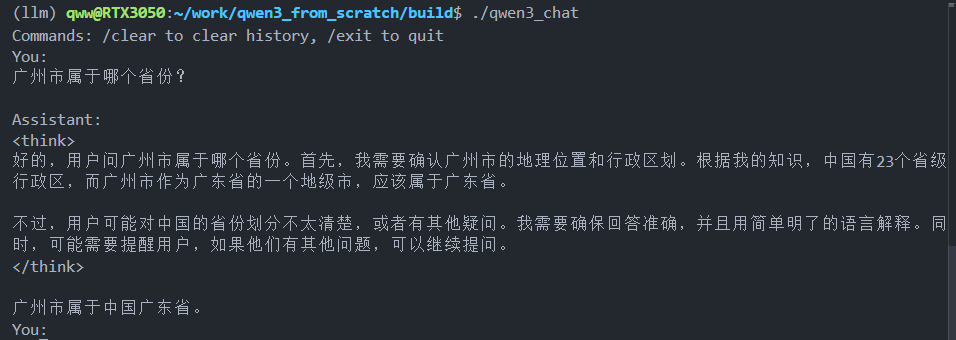

# Qwen3.cpp

用纯 C++（无第三方推理框架依赖）从零实现 Qwen3 语言模型的完整推理流程。

> 个人学习项目，目标是深入理解 LLM 推理引擎的底层原理。

## 功能

- BPE Tokenizer（含 byte-level 解码）
- RMSNorm、GQA Multi-Head Attention、SwiGLU MLP、RoPE 位置编码
- safetensors 权重加载
- Greedy 采样 + 文本解码
- 完整前向传播：Embedding → N × Decoder → Final Norm → LM Head → Softmax → Sampler

## 构建

**依赖**

- C++17
- CMake >= 3.15
- Boost.Regex（预分词用）

```bash
# Ubuntu/Debian
sudo apt-get install build-essential cmake libboost-regex-dev
```

**编译**

```bash
mkdir build && cd build
cmake ..
make -j4
```

## 运行

```bash
./qwen3 /path/to/tokenizer.json /path/to/model.safetensors
```

模型文件从 Hugging Face 下载 Qwen3 系列（如 Qwen3-0.6B）即可。

## 运行截图



## 项目结构

```
qwen3_from_scratch/
├── src/
│   ├── main.cpp          # 入口：加载模型、推理循环
│   ├── qwen3.h/cpp       # 模型主体
│   ├── operator.hpp      # 算子实现（Attention/MLP/RMSNorm/Sampler 等）
│   ├── tokenizer.h/cpp   # BPE Tokenizer + Decode
│   ├── tensor.h          # Tensor 数据结构
│   ├── type.h            # 基础类型定义
│   └── logger.h          # 日志工具
├── docs/
│   ├── architecture.md   # 架构说明
│   └── operators.md      # 算子说明
├── thirdparty/
│   └── nlohmann/         # JSON 解析库
└── CMakeLists.txt
```

## 架构文档
- **[architecture.md](docs/architecture.md)** - 架构说明
- **[operators.md](docs/operators.md)** - 算子说明
