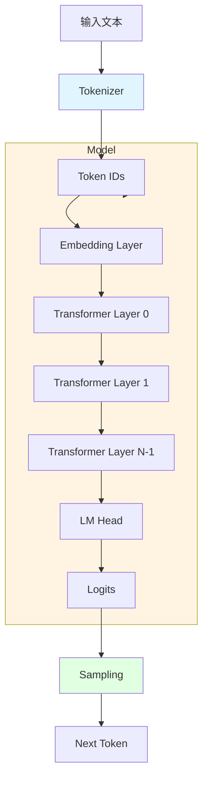
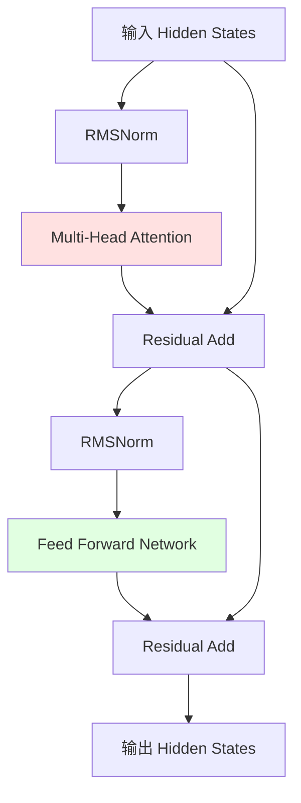

# Qwen3 基础架构（无 KV Cache）

> 本文档描述 Qwen3 模型的基础实现，**不包含 KV Cache 优化**。
> 目标是让你理解模型的核心原理，代码简单易懂。

## 整体架构



## 核心组件

### 1. Tokenizer（已实现）

**功能**：将文本转换为 Token IDs

```cpp
class Tokenizer {
    std::vector<uint32_t> Encode(const std::string& text);
    std::string Decode(const std::vector<uint32_t>& ids);
};
```

**示例**：
```
输入: "Hello world"
输出: [151643, 9906, 1917]
```

### 2. Embedding Layer

**功能**：将 Token IDs 转换为向量表示

```mermaid
graph LR
    TokenIDs[Token IDs<br/>[151643, 9906, 1917]] --> Lookup[查表]
    Lookup --> Embeddings[Embeddings<br/>[3, 896]]

    subgraph "Embedding 权重矩阵"
        Matrix[vocab_size × hidden_dim<br/>151936 × 896]
    end

    Lookup -.使用.-> Matrix
```

**代码结构**：
```cpp
class EmbeddingLayer {
public:
    EmbeddingLayer(size_t vocab_size, size_t hidden_dim);

    // 输入: token_ids [seq_len]
    // 输出: embeddings [seq_len, hidden_dim]
    Tensor Forward(const std::vector<uint32_t>& token_ids);

private:
    Tensor weight_;  // [vocab_size, hidden_dim]
};

Tensor EmbeddingLayer::Forward(const std::vector<uint32_t>& token_ids) {
    size_t seq_len = token_ids.size();
    Tensor output = AllocateTensor({seq_len, hidden_dim_});

    for (size_t i = 0; i < seq_len; ++i) {
        uint32_t token_id = token_ids[i];
        // 从权重矩阵中查找对应的向量
        CopyRow(weight_, token_id, output, i);
    }

    return output;
}
```

### 3. Transformer Layer

每个 Transformer Layer 包含两个主要部分：Attention 和 FFN



**代码结构**：
```cpp
class TransformerLayer {
public:
    TransformerLayer(size_t hidden_dim, size_t num_heads,
                     size_t num_kv_heads, size_t intermediate_dim);

    // 输入/输出: [seq_len, hidden_dim]
    Tensor Forward(const Tensor& hidden_states);

private:
    RMSNorm attn_norm_;
    AttentionLayer attention_;
    RMSNorm ffn_norm_;
    FFNLayer ffn_;
};

Tensor TransformerLayer::Forward(const Tensor& hidden_states) {
    // 1. Attention 分支
    Tensor normed = attn_norm_.Forward(hidden_states);
    Tensor attn_out = attention_.Forward(normed);
    Tensor residual1 = Add(hidden_states, attn_out);

    // 2. FFN 分支
    normed = ffn_norm_.Forward(residual1);
    Tensor ffn_out = ffn_.Forward(normed);
    Tensor residual2 = Add(residual1, ffn_out);

    return residual2;
}
```

### 4. Multi-Head Attention（基础版，无 Cache）

**核心思想**：让模型关注输入序列的不同位置

```mermaid
graph TB
    Input[输入 Hidden States<br/>[seq_len, hidden_dim]] --> Linear[线性投影]

    Linear --> Q[Query<br/>[seq_len, num_heads, head_dim]]
    Linear --> K[Key<br/>[seq_len, num_kv_heads, head_dim]]
    Linear --> V[Value<br/>[seq_len, num_kv_heads, head_dim]]

    Q --> RoPE1[Apply RoPE]
    K --> RoPE2[Apply RoPE]

    RoPE1 --> Q2[Q']
    RoPE2 --> K2[K']

    Q2 --> Expand[扩展 K, V<br/>GQA]
    K2 --> Expand
    V --> Expand

    Expand --> Attn[Attention<br/>Softmax(QK^T/√d)V]
    Attn --> Concat[Concat Heads]
    Concat --> OutProj[输出投影]
    OutProj --> Output[输出<br/>[seq_len, hidden_dim]]

    style Attn fill:#ffe1e1
```

**关键步骤**：

1. **线性投影**：生成 Q、K、V
2. **RoPE**：添加位置信息
3. **GQA**：扩展 K、V 的 head 数量
4. **Attention 计算**：`Softmax(QK^T / √d) × V`
5. **输出投影**：合并多头结果

**代码实现**：
```cpp
class AttentionLayer {
public:
    AttentionLayer(size_t hidden_dim, size_t num_heads, size_t num_kv_heads);

    Tensor Forward(const Tensor& hidden_states);

private:
    Tensor ComputeQKV(const Tensor& hidden);
    void ApplyRoPE(Tensor& q, Tensor& k);
    Tensor ComputeAttention(const Tensor& q, const Tensor& k, const Tensor& v);

    Tensor wq_, wk_, wv_, wo_;  // 权重矩阵
    size_t num_heads_;
    size_t num_kv_heads_;
    size_t head_dim_;
};

Tensor AttentionLayer::Forward(const Tensor& hidden_states) {
    size_t seq_len = hidden_states.shape[0];

    // 1. 计算 Q, K, V
    Tensor q = MatMul(hidden_states, wq_);  // [seq_len, num_heads * head_dim]
    Tensor k = MatMul(hidden_states, wk_);  // [seq_len, num_kv_heads * head_dim]
    Tensor v = MatMul(hidden_states, wv_);  // [seq_len, num_kv_heads * head_dim]

    // 2. Reshape 为多头形式
    q = Reshape(q, {seq_len, num_heads_, head_dim_});
    k = Reshape(k, {seq_len, num_kv_heads_, head_dim_});
    v = Reshape(v, {seq_len, num_kv_heads_, head_dim_});

    // 3. 应用 RoPE 位置编码
    ApplyRoPE(q, k);

    // 4. GQA: 扩展 K, V 的 head 数量
    if (num_heads_ != num_kv_heads_) {
        k = RepeatKVHeads(k, num_heads_ / num_kv_heads_);
        v = RepeatKVHeads(v, num_heads_ / num_kv_heads_);
    }

    // 5. 计算 Attention
    Tensor output = ComputeAttention(q, k, v);

    // 6. 输出投影
    output = Reshape(output, {seq_len, num_heads_ * head_dim_});
    output = MatMul(output, wo_);

    return output;
}

Tensor AttentionLayer::ComputeAttention(const Tensor& q,
                                        const Tensor& k,
                                        const Tensor& v) {
    // q, k, v: [seq_len, num_heads, head_dim]

    // 1. 计算注意力分数: Q @ K^T
    Tensor scores = MatMul(q, Transpose(k));  // [seq_len, num_heads, seq_len]

    // 2. 缩放
    float scale = 1.0f / std::sqrt(head_dim_);
    scores = Multiply(scores, scale);

    // 3. Softmax
    scores = Softmax(scores, /*dim=*/-1);

    // 4. 加权求和: Attention @ V
    Tensor output = MatMul(scores, v);  // [seq_len, num_heads, head_dim]

    return output;
}
```

**注意**：这个版本每次都重新计算所有 token 的 Attention，没有缓存。

### 5. RoPE（旋转位置编码）

**功能**：为 Q 和 K 添加位置信息，无需额外的位置编码层

```cpp
void ApplyRoPE(Tensor& tensor, size_t position) {
    // tensor: [seq_len, num_heads, head_dim]
    size_t seq_len = tensor.shape[0];
    size_t num_heads = tensor.shape[1];
    size_t head_dim = tensor.shape[2];

    for (size_t pos = 0; pos < seq_len; ++pos) {
        for (size_t h = 0; h < num_heads; ++h) {
            for (size_t d = 0; d < head_dim / 2; ++d) {
                // 计算旋转角度
                float theta = position / std::pow(10000.0f, 2.0f * d / head_dim);

                // 获取当前维度的值
                float x0 = tensor.at(pos, h, 2 * d);
                float x1 = tensor.at(pos, h, 2 * d + 1);

                // 应用旋转
                tensor.at(pos, h, 2 * d) = x0 * std::cos(theta) - x1 * std::sin(theta);
                tensor.at(pos, h, 2 * d + 1) = x0 * std::sin(theta) + x1 * std::cos(theta);
            }
        }
    }
}
```

### 6. Feed Forward Network (SwiGLU)

**结构**：使用 SwiGLU 激活函数的 FFN

```mermaid
graph LR
    Input[输入<br/>[seq_len, hidden_dim]] --> Gate[Gate 投影<br/>w_gate]
    Input --> Up[Up 投影<br/>w_up]

    Gate --> SiLU[SiLU 激活]
    SiLU --> Mul[逐元素相乘]
    Up --> Mul

    Mul --> Down[Down 投影<br/>w_down]
    Down --> Output[输出<br/>[seq_len, hidden_dim]]
```

**代码实现**：
```cpp
class FFNLayer {
public:
    FFNLayer(size_t hidden_dim, size_t intermediate_dim);

    Tensor Forward(const Tensor& hidden_states);

private:
    Tensor w_gate_, w_up_, w_down_;
};

Tensor FFNLayer::Forward(const Tensor& hidden_states) {
    // 1. Gate 分支（带激活）
    Tensor gate = MatMul(hidden_states, w_gate_);
    gate = SiLU(gate);  // SiLU(x) = x * sigmoid(x)

    // 2. Up 分支（无激活）
    Tensor up = MatMul(hidden_states, w_up_);

    // 3. 逐元素相乘（SwiGLU）
    Tensor hidden = Multiply(gate, up);

    // 4. Down 投影
    Tensor output = MatMul(hidden, w_down_);

    return output;
}

Tensor SiLU(const Tensor& x) {
    // SiLU(x) = x * sigmoid(x) = x / (1 + exp(-x))
    Tensor sigmoid_x = Sigmoid(x);
    return Multiply(x, sigmoid_x);
}
```

### 7. RMSNorm

**功能**：归一化层，比 LayerNorm 更简单高效

```cpp
class RMSNorm {
public:
    RMSNorm(size_t hidden_dim, float eps = 1e-6);

    Tensor Forward(const Tensor& hidden_states);

private:
    Tensor weight_;  // [hidden_dim]
    float eps_;
};

Tensor RMSNorm::Forward(const Tensor& hidden_states) {
    // hidden_states: [seq_len, hidden_dim]

    Tensor output = AllocateTensor(hidden_states.shape);

    for (size_t i = 0; i < hidden_states.shape[0]; ++i) {
        // 1. 计算 RMS
        float sum_sq = 0.0f;
        for (size_t j = 0; j < hidden_dim_; ++j) {
            float val = hidden_states.at(i, j);
            sum_sq += val * val;
        }
        float rms = std::sqrt(sum_sq / hidden_dim_ + eps_);

        // 2. 归一化并缩放
        for (size_t j = 0; j < hidden_dim_; ++j) {
            output.at(i, j) = hidden_states.at(i, j) / rms * weight_.at(j);
        }
    }

    return output;
}
```

### 8. LM Head

**功能**：将最后一层的 hidden states 映射到词表空间

```cpp
class LMHead {
public:
    LMHead(size_t hidden_dim, size_t vocab_size);

    // 输入: [seq_len, hidden_dim]
    // 输出: [seq_len, vocab_size]
    Tensor Forward(const Tensor& hidden_states);

private:
    Tensor weight_;  // [hidden_dim, vocab_size]
};

Tensor LMHead::Forward(const Tensor& hidden_states) {
    return MatMul(hidden_states, weight_);
}
```

### 9. Sampling（采样）

**功能**：从 logits 中选择下一个 token

```cpp
uint32_t Sample(const Tensor& logits, float temperature = 1.0, float top_p = 0.9) {
    // logits: [vocab_size]

    // 1. Temperature scaling
    Tensor scaled_logits = Divide(logits, temperature);

    // 2. Softmax 转换为概率
    Tensor probs = Softmax(scaled_logits);

    // 3. Top-P (Nucleus) Sampling
    std::vector<std::pair<float, uint32_t>> prob_idx;
    for (size_t i = 0; i < probs.size; ++i) {
        prob_idx.push_back({probs.at(i), i});
    }

    // 按概率降序排序
    std::sort(prob_idx.begin(), prob_idx.end(),
              [](auto& a, auto& b) { return a.first > b.first; });

    // 累积概率达到 top_p 时截断
    float cumsum = 0.0f;
    size_t cutoff = 0;
    for (size_t i = 0; i < prob_idx.size(); ++i) {
        cumsum += prob_idx[i].first;
        if (cumsum >= top_p) {
            cutoff = i + 1;
            break;
        }
    }

    // 从 top-p 候选中随机采样
    float rand_val = RandomFloat(0.0f, cumsum);
    cumsum = 0.0f;
    for (size_t i = 0; i < cutoff; ++i) {
        cumsum += prob_idx[i].first;
        if (cumsum >= rand_val) {
            return prob_idx[i].second;
        }
    }

    return prob_idx[0].second;  // fallback
}
```

## 完整推理流程

```cpp
class Qwen3Model {
public:
    std::string Generate(const std::string& prompt, size_t max_new_tokens);

private:
    Tokenizer tokenizer_;
    EmbeddingLayer embedding_;
    std::vector<TransformerLayer> layers_;
    RMSNorm final_norm_;
    LMHead lm_head_;
};

std::string Qwen3Model::Generate(const std::string& prompt,
                                 size_t max_new_tokens) {
    // 1. Tokenize
    std::vector<uint32_t> token_ids = tokenizer_.Encode(prompt);

    // 2. 生成循环
    for (size_t i = 0; i < max_new_tokens; ++i) {
        // 3. Embedding
        Tensor hidden = embedding_.Forward(token_ids);

        // 4. Transformer Layers
        for (auto& layer : layers_) {
            hidden = layer.Forward(hidden);  // 每次都计算所有 token
        }

        // 5. Final Norm
        hidden = final_norm_.Forward(hidden);

        // 6. LM Head（只取最后一个 token）
        Tensor last_hidden = GetLastToken(hidden);
        Tensor logits = lm_head_.Forward(last_hidden);

        // 7. Sample
        uint32_t next_token = Sample(logits);
        token_ids.push_back(next_token);

        // 8. 检查结束符
        if (next_token == eos_token_id_) break;
    }

    // 9. Decode
    return tokenizer_.Decode(token_ids);
}
```

## 性能分析

### 时间复杂度

生成 N 个 token 的总计算量：

```
第 1 个 token: 处理 1 个 token
第 2 个 token: 处理 2 个 token (重新计算第 1 个)
第 3 个 token: 处理 3 个 token (重新计算前 2 个)
...
第 N 个 token: 处理 N 个 token

总计算量 = 1 + 2 + 3 + ... + N = N(N+1)/2 ≈ O(N²)
```

### 为什么慢？

每次生成新 token 时，都要重新计算之前所有 token 的 K、V，造成大量重复计算。

### 解决方案

引入 **KV Cache** 优化 → 详见 [KVCACHE_ARCHITECTURE.md](KVCACHE_ARCHITECTURE.md)

## 下一步

1. ✅ 理解基础架构
2. 🔨 实现各个组件
3. 🧪 测试验证
4. 📊 性能分析
5. 🚀 引入 KV Cache 优化

---

**准备好了吗？** 开始实现你的第一个 Transformer 模型吧！

遇到问题？查看 [IMPLEMENTATION_GUIDE.md](IMPLEMENTATION_GUIDE.md) 获取更多帮助。
