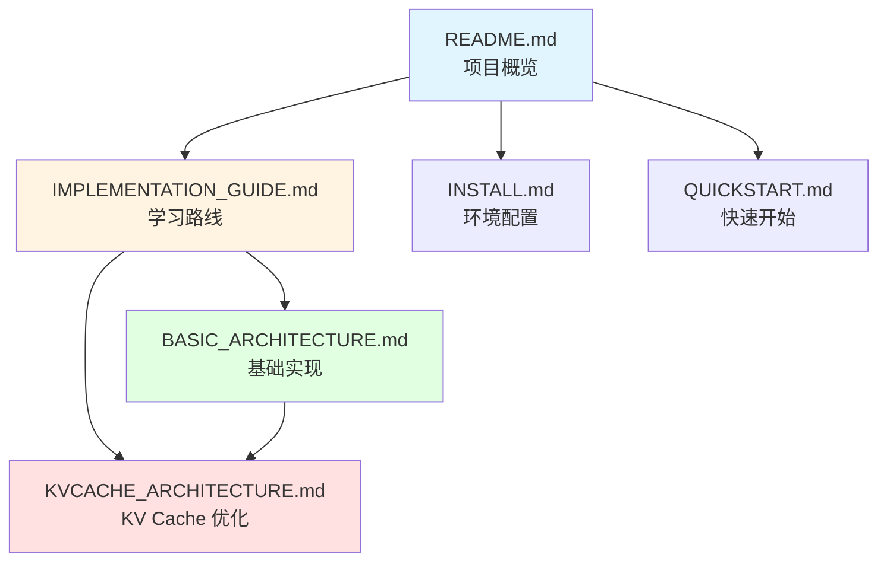

# 文档索引

## 📖 学习路径（推荐顺序）

### 新手入门
1. **[README.md](README.md)** - 项目概览和快速开始
2. **[IMPLEMENTATION_GUIDE.md](IMPLEMENTATION_GUIDE.md)** - 完整学习路线图
3. **[BASIC_ARCHITECTURE.md](BASIC_ARCHITECTURE.md)** - 基础架构详解（必读）

### 进阶优化
4. **[KVCACHE_ARCHITECTURE.md](KVCACHE_ARCHITECTURE.md)** - KV Cache 性能优化

### 环境配置
- **[INSTALL.md](INSTALL.md)** - Ubuntu 环境配置
- **[QUICKSTART.md](QUICKSTART.md)** - 快速开始指南

### 开发记录
- **[REFACTOR.md](REFACTOR.md)** - 代码重构记录

---

## 📚 文档详情

### 核心文档

| 文档 | 大小 | 内容 | 适合人群 |
|------|------|------|---------|
| [README.md](README.md) | 2.6K | 项目介绍、快速开始 | 所有人 |
| [IMPLEMENTATION_GUIDE.md](IMPLEMENTATION_GUIDE.md) | 4.2K | 学习路线、阶段划分 | 初学者 |
| [BASIC_ARCHITECTURE.md](BASIC_ARCHITECTURE.md) | 14K | 基础架构、代码实现 | 开发者 |
| [KVCACHE_ARCHITECTURE.md](KVCACHE_ARCHITECTURE.md) | 13K | KV Cache 优化 | 进阶开发者 |

### 辅助文档

| 文档 | 大小 | 内容 |
|------|------|------|
| [INSTALL.md](INSTALL.md) | 1.3K | 环境安装 |
| [QUICKSTART.md](QUICKSTART.md) | 1.6K | 快速开始 |
| [REFACTOR.md](REFACTOR.md) | 2.4K | 重构记录 |

---

## 🎯 按需查阅

### 我想了解项目
→ [README.md](README.md)

### 我想开始学习
→ [IMPLEMENTATION_GUIDE.md](IMPLEMENTATION_GUIDE.md)

### 我想实现基础版本
→ [BASIC_ARCHITECTURE.md](BASIC_ARCHITECTURE.md)

### 我想优化性能
→ [KVCACHE_ARCHITECTURE.md](KVCACHE_ARCHITECTURE.md)

### 我想配置环境
→ [INSTALL.md](INSTALL.md)

### 我想快速测试
→ [QUICKSTART.md](QUICKSTART.md)

---

## 📊 文档关系图

---

## 💡 学习建议

### 第一次接触 Transformer？
1. 阅读 [IMPLEMENTATION_GUIDE.md](IMPLEMENTATION_GUIDE.md) 了解整体架构
2. 仔细阅读 [BASIC_ARCHITECTURE.md](BASIC_ARCHITECTURE.md) 的每个组件
3. 动手实现每个模块
4. 不要急于优化，先确保基础版本正确

### 已经理解基础实现？
1. 直接跳到 [KVCACHE_ARCHITECTURE.md](KVCACHE_ARCHITECTURE.md)
2. 对比基础版和优化版的差异
3. 实现 KV Cache 管理器
4. 测量性能提升

### 只想快速运行？
1. 查看 [QUICKSTART.md](QUICKSTART.md)
2. 按照步骤编译运行
3. 如果遇到问题，参考 [INSTALL.md](INSTALL.md)

---

**总文档量**：约 40K 字
**预计学习时间**：
- 快速浏览：1-2 小时
- 深入理解：1-2 天
- 完整实现：1-2 周
