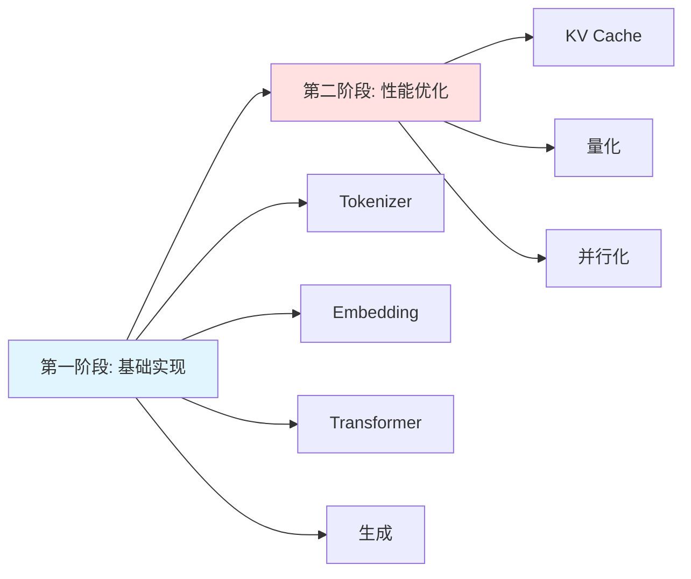

# Qwen3.cpp 实现指南

## 学习路线

本项目采用循序渐进的方式，从简单到复杂逐步实现 Qwen3 模型：



### 📚 文档导航

| 阶段 | 文档 | 内容 | 状态 |
|------|------|------|------|
| 基础 | [BASIC_ARCHITECTURE.md](BASIC_ARCHITECTURE.md) | 基础架构（无优化） | ✅ |
| 优化 | [KVCACHE_ARCHITECTURE.md](KVCACHE_ARCHITECTURE.md) | KV Cache 优化 | ✅ |
| 优化 | QUANTIZATION.md | 量化技术 | 🚧 待实现 |

## 第一阶段：基础实现（推荐从这里开始）

### 目标
实现一个功能完整但未优化的 Qwen3 模型，重点是**理解原理**而非性能。

### 特点
- ✅ 代码简单清晰
- ✅ 易于调试
- ✅ 适合学习
- ❌ 推理速度较慢
- ❌ 内存效率低

### 实现内容
1. **Tokenizer**：BPE 编码
2. **Embedding**：Token → 向量
3. **Transformer Layer**：
   - RMSNorm
   - Multi-Head Attention（无 Cache）
   - SwiGLU FFN
   - RoPE 位置编码
4. **LM Head**：输出 logits
5. **采样**：Temperature、Top-P

### 推理流程（基础版）

```
输入文本: "Hello world"
    ↓
Tokenizer.Encode()
    ↓
Token IDs: [151643, 9906, 1917]
    ↓
Embedding Layer
    ↓
Hidden States: [3, 896]  (seq_len × hidden_dim)
    ↓
┌─────────────────────────────────┐
│ Transformer Layer 0             │
│  ├─ RMSNorm                     │
│  ├─ Attention (重新计算所有)    │  ← 每次都计算全部
│  ├─ Residual Add                │
│  ├─ RMSNorm                     │
│  ├─ FFN                         │
│  └─ Residual Add                │
└─────────────────────────────────┘
    ↓
... (重复 N 层)
    ↓
LM Head
    ↓
Logits: [3, vocab_size]
    ↓
Sample (取最后一个 token 的 logits)
    ↓
Next Token ID: 151645
```

## 第二阶段：性能优化

### 目标
在理解基础实现后，引入各种优化技术提升性能。

### KV Cache 优化
- 📖 详见 [KVCACHE_ARCHITECTURE.md](KVCACHE_ARCHITECTURE.md)
- 🎯 加速比：约 50 倍（生成 100 tokens）
- 💾 代价：增加内存占用

### 其他优化（待实现）
- **量化**：INT8/INT4，减少内存和计算量
- **算子融合**：减少内存访问
- **并行化**：多线程/SIMD

## 快速开始

### 1. 编译基础版本
```bash
# 安装依赖
sudo apt-get install build-essential libboost-regex-dev

# 编译
make

# 或使用 CMake
mkdir build && cd build
cmake ..
make
```

### 2. 运行测试
```bash
./qwen3 path/to/tokenizer.json path/to/model.safetensors
```

### 3. 学习路径建议

1. **阅读基础架构文档**：[BASIC_ARCHITECTURE.md](BASIC_ARCHITECTURE.md)
2. **实现基础版本**：按照文档逐步实现
3. **测试验证**：确保输出正确
4. **性能分析**：测量推理速度
5. **引入 KV Cache**：阅读 [KVCACHE_ARCHITECTURE.md](KVCACHE_ARCHITECTURE.md)
6. **对比性能**：观察加速效果

## 代码组织

```
qwen3.cpp/
├── tokenizer.h/cpp      # Tokenizer 实现
├── type.h               # 基础数据结构
├── model.h/cpp          # 模型主体（待实现）
│   ├── embedding.cpp    # Embedding 层
│   ├── attention.cpp    # Attention 层
│   ├── ffn.cpp          # FFN 层
│   └── transformer.cpp  # Transformer 层
├── kvcache.h/cpp        # KV Cache（优化阶段）
└── main.cpp             # 主程序
```

## 性能对比

| 版本 | 生成 100 tokens | 内存占用 | 代码复杂度 |
|------|----------------|---------|-----------|
| 基础版（无 Cache） | ~50 秒 | 低 | ⭐ 简单 |
| KV Cache 版 | ~1 秒 | 高 | ⭐⭐ 中等 |
| 量化 + Cache | ~0.5 秒 | 中 | ⭐⭐⭐ 复杂 |

*注：时间为示例，实际取决于硬件和模型大小*

## 下一步

👉 开始学习：[BASIC_ARCHITECTURE.md](BASIC_ARCHITECTURE.md)
