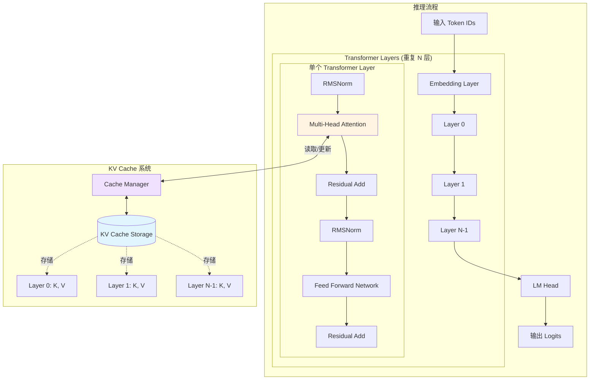
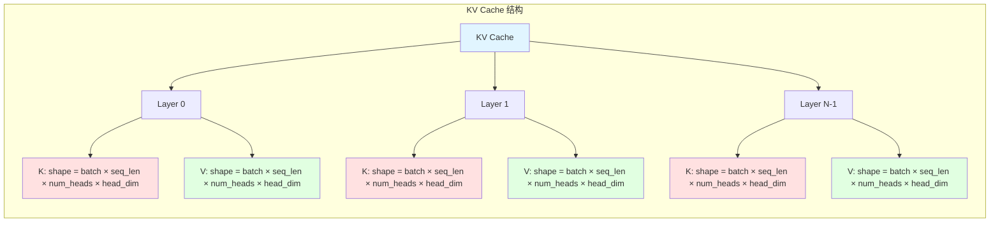
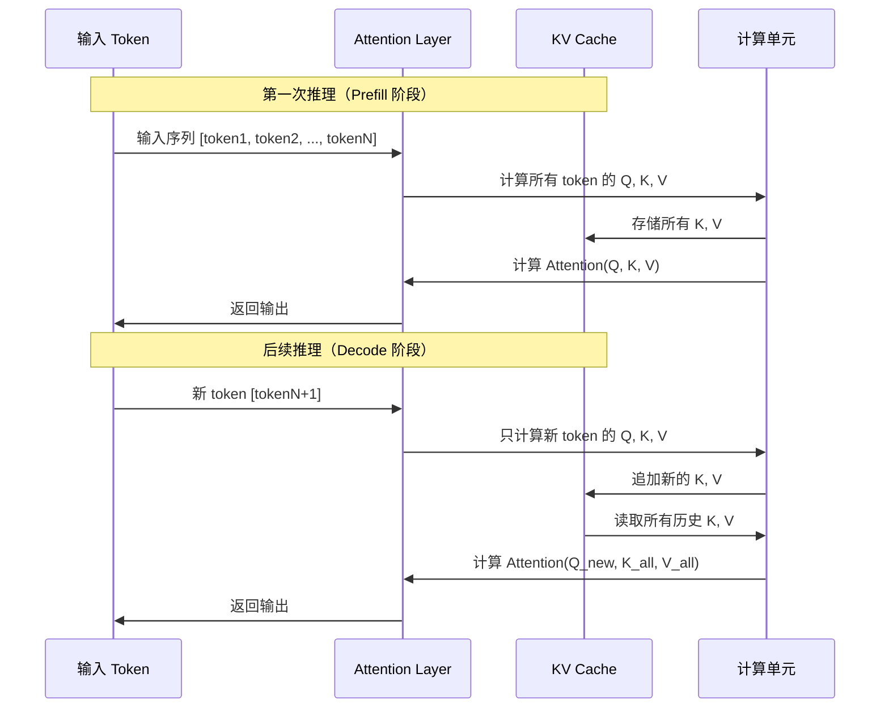
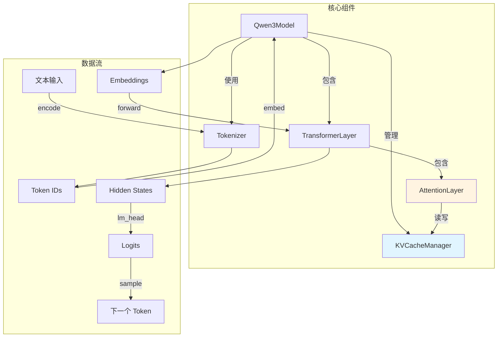

# KV Cache 架构设计（高级优化）

> ⚠️ **前置要求**：请先阅读 [BASIC_ARCHITECTURE.md](BASIC_ARCHITECTURE.md) 理解基础实现
>
> 本文档介绍 KV Cache 优化技术，这是在基础实现之上的性能优化。

## 概述

KV Cache 是 Transformer 自回归生成的关键优化技术。在生成每个新 token 时，不需要重新计算之前所有 token 的 Key 和 Value，而是将它们缓存起来复用。

### 为什么需要这个优化？

在基础实现中，每次生成新 token 都要重新计算所有历史 token 的 K、V，导致 O(N²) 的时间复杂度。KV Cache 通过缓存已计算的 K、V，将复杂度降低到 O(N)。

### 为什么需要这个优化？

在基础实现中，每次生成新 token 都要重新计算所有历史 token 的 K、V，导致 O(N²) 的时间复杂度。KV Cache 通过缓存已计算的 K、V，将复杂度降低到 O(N)。

### 对比：基础版 vs KV Cache 版

| 方面 | 基础版（无 Cache） | KV Cache 版 |
|------|------------------|-------------|
| **时间复杂度** | O(N²) | O(N) |
| **生成 100 tokens** | ~50 秒 | ~1 秒 |
| **内存占用** | 低 | 高（需存储所有 K、V） |
| **代码复杂度** | 简单 | 中等 |
| **适用场景** | 学习、短序列 | 生产环境、长序列 |

### 基础版的问题

```
生成第 1 个 token: 计算 1 个 token 的 K、V
生成第 2 个 token: 重新计算 2 个 token 的 K、V  ← 第 1 个重复了
生成第 3 个 token: 重新计算 3 个 token 的 K、V  ← 前 2 个重复了
...
生成第 100 个 token: 重新计算 100 个 token 的 K、V ← 前 99 个都重复了

总计算量 = 1 + 2 + 3 + ... + 100 = 5050 次
```

### KV Cache 的解决方案

```
生成第 1 个 token: 计算 1 个 token 的 K、V，存入 Cache
生成第 2 个 token: 只计算新 token 的 K、V，追加到 Cache
生成第 3 个 token: 只计算新 token 的 K、V，追加到 Cache
...
生成第 100 个 token: 只计算新 token 的 K、V，追加到 Cache

总计算量 = 100 次（加速 50 倍！）
```

---

## 前置知识回顾

在基础实现中，Attention 的计算流程是：

```cpp
// 基础版 Attention（每次都重新计算所有 token）
Tensor AttentionLayer::Forward(const Tensor& hidden_states) {
    // hidden_states: [seq_len, hidden_dim]
    // 每次都处理完整的序列

    Tensor q = MatMul(hidden_states, wq_);  // 计算所有 token 的 Q
    Tensor k = MatMul(hidden_states, wk_);  // 计算所有 token 的 K ← 重复计算
    Tensor v = MatMul(hidden_states, wv_);  // 计算所有 token 的 V ← 重复计算

    // ... Attention 计算
}
```

**问题**：每次生成新 token 时，`hidden_states` 包含所有历史 token，导致 K、V 被重复计算。

---

## 整体架构



## KV Cache 数据结构



## Attention 计算流程（使用 KV Cache）



## 关键组件关系



## 代码实现设计

### 数据结构定义

```cpp
// KV Cache 单层存储
struct LayerKVCache {
    Tensor k;  // shape: [batch, seq_len, num_kv_heads, head_dim]
    Tensor v;  // shape: [batch, seq_len, num_kv_heads, head_dim]
    size_t current_length;  // 当前缓存的序列长度
};

// KV Cache 管理器
class KVCacheManager {
public:
    KVCacheManager(size_t num_layers, size_t max_seq_len,
                   size_t num_kv_heads, size_t head_dim);

    // 获取指定层的 KV Cache
    LayerKVCache& GetLayerCache(size_t layer_idx);

    // 追加新的 K、V 到指定层
    void Append(size_t layer_idx, const Tensor& k, const Tensor& v);

    // 清空所有缓存（开始新的生成）
    void Clear();

    // 获取当前序列长度
    size_t GetSeqLength() const;

private:
    std::vector<LayerKVCache> caches_;  // 每层一个 cache
    size_t max_seq_len_;
    size_t num_layers_;
};
```

### Attention 层使用 KV Cache

```cpp
class AttentionLayer {
public:
    Tensor Forward(const Tensor& hidden_states,
                   KVCacheManager& kv_cache,
                   size_t layer_idx,
                   bool use_cache = true) {

        // 1. 计算当前 token 的 Q, K, V
        Tensor q = ComputeQuery(hidden_states);      // [batch, 1, num_heads, head_dim]
        Tensor k_new = ComputeKey(hidden_states);    // [batch, 1, num_kv_heads, head_dim]
        Tensor v_new = ComputeValue(hidden_states);  // [batch, 1, num_kv_heads, head_dim]

        Tensor k_all, v_all;

        if (use_cache) {
            // 2. 追加新的 K、V 到 cache
            kv_cache.Append(layer_idx, k_new, v_new);

            // 3. 获取完整的 K、V（包括历史）
            auto& cache = kv_cache.GetLayerCache(layer_idx);
            k_all = cache.k;  // [batch, seq_len, num_kv_heads, head_dim]
            v_all = cache.v;  // [batch, seq_len, num_kv_heads, head_dim]
        } else {
            // 不使用 cache（例如 prefill 阶段）
            k_all = k_new;
            v_all = v_new;
        }

        // 4. 应用 RoPE（旋转位置编码）
        size_t position = kv_cache.GetSeqLength() - 1;
        ApplyRoPE(q, position);
        ApplyRoPE(k_all, position);

        // 5. 计算 Attention
        // 如果使用 GQA，需要扩展 K、V 的 head 数量
        Tensor k_expanded = ExpandKVHeads(k_all);  // [batch, seq_len, num_heads, head_dim]
        Tensor v_expanded = ExpandKVHeads(v_all);

        Tensor output = ComputeAttention(q, k_expanded, v_expanded);

        return output;
    }
};
```

### 推理流程

```cpp
class Qwen3Model {
public:
    std::vector<uint32_t> Generate(const std::string& prompt,
                                    size_t max_new_tokens) {
        // 1. Tokenize
        std::vector<uint32_t> input_ids = tokenizer_.Encode(prompt);

        // 2. 清空 KV Cache（开始新的生成）
        kv_cache_.Clear();

        std::vector<uint32_t> output_ids = input_ids;

        // 3. Prefill 阶段：处理 prompt
        Tensor hidden = Embed(input_ids);
        for (size_t layer = 0; layer < num_layers_; ++layer) {
            hidden = transformer_layers_[layer].Forward(hidden, kv_cache_, layer, true);
        }
        Tensor logits = LMHead(hidden);
        uint32_t next_token = Sample(logits);
        output_ids.push_back(next_token);

        // 4. Decode 阶段：逐个生成 token
        for (size_t i = 1; i < max_new_tokens; ++i) {
            // 只处理新生成的 token
            hidden = Embed({next_token});

            for (size_t layer = 0; layer < num_layers_; ++layer) {
                // 使用 KV Cache，避免重复计算
                hidden = transformer_layers_[layer].Forward(hidden, kv_cache_, layer, true);
            }

            logits = LMHead(hidden);
            next_token = Sample(logits);
            output_ids.push_back(next_token);

            // 检查是否生成结束符
            if (next_token == eos_token_id_) break;
        }

        return output_ids;
    }

private:
    Tokenizer tokenizer_;
    KVCacheManager kv_cache_;
    std::vector<TransformerLayer> transformer_layers_;
    size_t num_layers_;
    uint32_t eos_token_id_;
};
```

## 内存管理策略

### 1. 预分配策略
```cpp
// 在初始化时预分配最大长度的内存
KVCacheManager::KVCacheManager(size_t num_layers, size_t max_seq_len,
                               size_t num_kv_heads, size_t head_dim) {
    for (size_t i = 0; i < num_layers; ++i) {
        LayerKVCache cache;
        // 预分配 max_seq_len 的空间
        cache.k = AllocateTensor({1, max_seq_len, num_kv_heads, head_dim});
        cache.v = AllocateTensor({1, max_seq_len, num_kv_heads, head_dim});
        cache.current_length = 0;
        caches_.push_back(cache);
    }
}
```

### 2. 动态增长策略
```cpp
// 按需增长，节省内存
void KVCacheManager::Append(size_t layer_idx, const Tensor& k, const Tensor& v) {
    auto& cache = caches_[layer_idx];

    if (cache.current_length + 1 > cache.k.shape[1]) {
        // 需要扩容
        size_t new_size = std::min(cache.k.shape[1] * 2, max_seq_len_);
        cache.k = ResizeTensor(cache.k, {1, new_size, num_kv_heads_, head_dim_});
        cache.v = ResizeTensor(cache.v, {1, new_size, num_kv_heads_, head_dim_});
    }

    // 追加新的 K、V
    CopyToPosition(cache.k, k, cache.current_length);
    CopyToPosition(cache.v, v, cache.current_length);
    cache.current_length++;
}
```

## 性能对比

| 方法 | 时间复杂度 | 空间复杂度 | 适用场景 |
|------|-----------|-----------|---------|
| 无 Cache | O(n²) | O(1) | 短序列、单次推理 |
| KV Cache | O(n) | O(n × layers × heads × dim) | 长序列生成、交互式对话 |

### 示例：生成 100 个 token

- **无 Cache**：需要计算 1 + 2 + 3 + ... + 100 = 5050 次 Attention
- **有 Cache**：只需要计算 100 次 Attention（每次只计算新 token）
- **加速比**：约 50 倍

## 注意事项

1. **内存占用**：KV Cache 会占用大量内存，需要根据硬件限制设置 `max_seq_len`
2. **批处理**：多个请求可以共享模型参数，但每个请求需要独立的 KV Cache
3. **GQA 优化**：Qwen3 使用 Grouped Query Attention，KV heads 数量少于 Q heads，进一步节省内存
4. **清空时机**：每次开始新的生成任务时，需要调用 `Clear()` 清空缓存

