# Qwen3.cpp Architecture

## 1. 项目目标
`qwen3_from_scratch` 的核心目标是：用纯 C++17 实现一个可读、可跑通的 Qwen3 推理最小系统，帮助理解 LLM 从输入文本到下一个 token 输出的全过程。

## 2. 模块划分

### 2.1 `src/tensor.h`
职责：定义最基础的 `Tensor` 容器。
- 保存 `shape_`、`data_`、`elem_size_`
- 提供 `clone()`
- 提供逐元素加法 `operator+`

### 2.2 `src/tokenizer.h/.cpp`
职责：完成文本与 token id 的双向转换。
- `LoadConfig`：加载 tokenizer 配置
- `Encode`：文本 -> token IDs
- `Decode`：token IDs -> 文本

### 2.3 `src/operator.hpp`
职责：实现推理中所有核心算子。
- `Embedding`
- `RMSNorm`
- `LinearProjection`
- `Attention`（含 RoPE + causal mask + GQA 逻辑）
- `MLP`（SwiGLU）
- `Decoder`
- `SoftMax`
- `Sampler`（greedy）

### 2.4 `src/qwen3.h/.cpp`
职责：定义 `Qwen3Model` 并连接模型结构与权重加载。
- `Load`：解析配置、读取 safetensors、装配算子权重
- `Forward`：执行完整前向

### 2.5 `src/main.cpp`
职责：教学示例入口。
- 分步骤演示加载、编码、前向、采样
- 支持 `--verbose` 打印 logits 信息
- 支持 `--dump` 输出 logits 到文件
- 输出简易耗时统计

## 3. 运行时数据流

完整链路如下：

`Text -> Tokenizer::Encode -> token_ids -> Qwen3Model::Forward -> logits -> Sampler::Sample -> next_token_id -> Tokenizer::Decode`

模型内部前向：

`Embedding -> N x Decoder -> Final RMSNorm -> LM Head (LinearProjection) -> Softmax`

## 4. 后续扩展方向

- 性能：KV Cache、算子融合、SIMD、并行化
- 功能：Top-k/Top-p/Temperature 采样

## 5. Qwen3模型推理架构图

```mermaid
graph TD
    %% --- 样式定义 ---
    classDef io fill:#f9f,stroke:#333,stroke-width:2px;
    classDef process fill:#e1f5fe,stroke:#0277bd,stroke-width:2px;
    classDef memory fill:#fff9c4,stroke:#fbc02d,stroke-width:2px;
    classDef loopBlock fill:#f3e5f5,stroke:#7b1fa2,stroke-width:2px,stroke-dasharray: 5 5;

    %% --- 1. 预处理与分词阶段 ---
    subgraph Tokenizer_Stage [阶段一: Tokenizer & Embedding]
        direction TB
        Input(输入文本 / User Prompt):::io
        --> PreToken["预分词 / Pre-tokenization<br/>(Regex Split & Unicode Normalize)"]:::process
        --> BPE["BPE 编码 / Byte-Pair Encoding<br/>(查表 Merge Ranks)"]:::process
        --> TokenIDs[Token IDs 序列]:::io
        --> EmbedLookup["Embedding 层查找<br/>Input IDs -> Hidden States"]:::process
    end

    %% --- 2. Transformer 层循环 ---
    subgraph Transformer_Blocks [阶段二: Decoder Layers 循环 L 次]
        direction TB
        
        %% 层输入节点
        BlockStart((Layer i Input))
        
        %% Attention 块
        subgraph Attn_Block [Attention Mechanism]
            direction TB
            RMS1[RMSNorm 1]:::process
            QKV_Proj["Q, K, V 线性投影<br/>(Linear Projection)"]:::process
            QK_Norm["Q, K RMSNorm"]:::process
            RoPE["应用 RoPE<br/>(旋转位置编码)"]:::process
            CacheOp["更新 KV Cache<br/>(保存当前 K, V 供后续使用)"]:::memory
            AttnScore["计算 Attention Scores<br/>(Q * K^T / sqrt_d + Mask)"]:::process
            Softmax[Softmax]:::process
            WeightedSum["加权求和<br/>(Score * V)"]:::process
            Out_Proj["Output 线性投影<br/>(Linear Projection)"]:::process
            
            %% Attn 内部连接
            RMS1 --> QKV_Proj
            QKV_Proj --> QK_Norm
            QK_Norm -- Q, K --> RoPE
            QKV_Proj -- V --> CacheOp
            RoPE --> CacheOp
            CacheOp --> AttnScore
            AttnScore --> Softmax
            Softmax --> WeightedSum
            WeightedSum --> Out_Proj
        end
        
        %% 残差连接节点 1
        ResAdd1((+)):::process

        %% FFN 块
        subgraph FFN_Block [Feed Forward / MLP]
            direction TB
            RMS2[RMSNorm 2]:::process
            GateUp["Gate & Up 线性投影<br/>(Linear Projection)"]:::process
            SwiGLU["激活函数 SwiGLU<br/>(SiLU(Gate) * Up)"]:::process
            Down["Down 线性投影<br/>(Linear Projection)"]:::process
            
            %% FFN 内部连接
            RMS2 --> GateUp
            GateUp --> SwiGLU
            SwiGLU --> Down
        end

        %% 残差连接节点 2
        ResAdd2((+)):::process

        %% Transformer 层级内部的跨块连接 (关键修复: 将连接逻辑放在子图定义之外)
        BlockStart --> RMS1
        BlockStart --> ResAdd1
        Out_Proj --> ResAdd1
        
        ResAdd1 --> RMS2
        ResAdd1 --> ResAdd2
        Down --> ResAdd2
    end

    %% 应用之前定义的虚线样式给 Transformer Block
    class Transformer_Blocks loopBlock

    %% --- 3. 输出与采样阶段 ---
    subgraph Output_Stage [阶段三: LM Head & Sampling]
        direction TB
        FinalRMS[Final RMSNorm]:::process
        LM_Head["LM Head 线性层<br/>(Hidden -> Vocab Size)"]:::process
        Logits[Logits]:::io
        PostProcess["后处理<br/>(Temperature / Top-P / Repetition Penalty)"]:::process
        SoftmaxFinal[Softmax / Argmax]:::process
        NextToken[输出 Next Token ID]:::io

        %% Output 内部连接
        FinalRMS --> LM_Head
        LM_Head --> Logits
        Logits --> PostProcess
        PostProcess --> SoftmaxFinal
        SoftmaxFinal --> NextToken
    end

    %% --- 4. 全局连接 ---
    %% 连接各阶段
    EmbedLookup --> BlockSt
    ResAdd2 -- 最后一层输出 --> FinalRMS

    %% 自回归循环 (Autoregression)
    NextToken -- "追加到输入" --> EmbedLookup
    NextToken -- "若是 EOS Token" --> Stop((结束推理)):::io

    %% 全局连线样式
    linkStyle default stroke:#333,stroke-width:1px;

```

