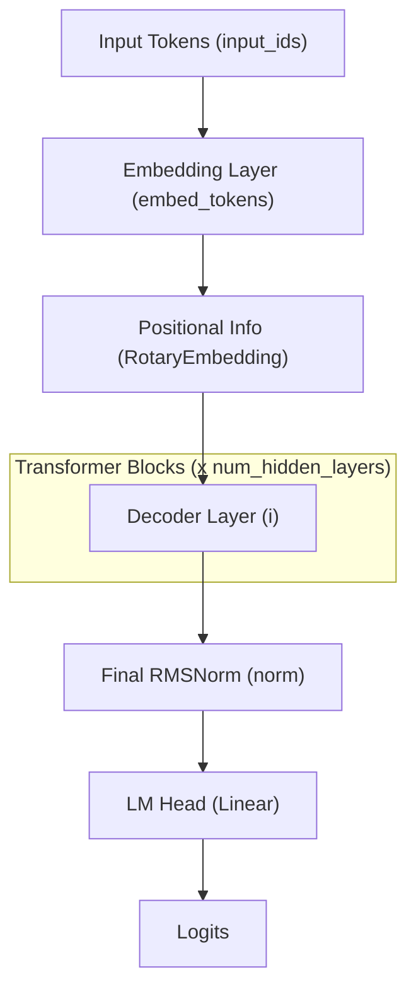
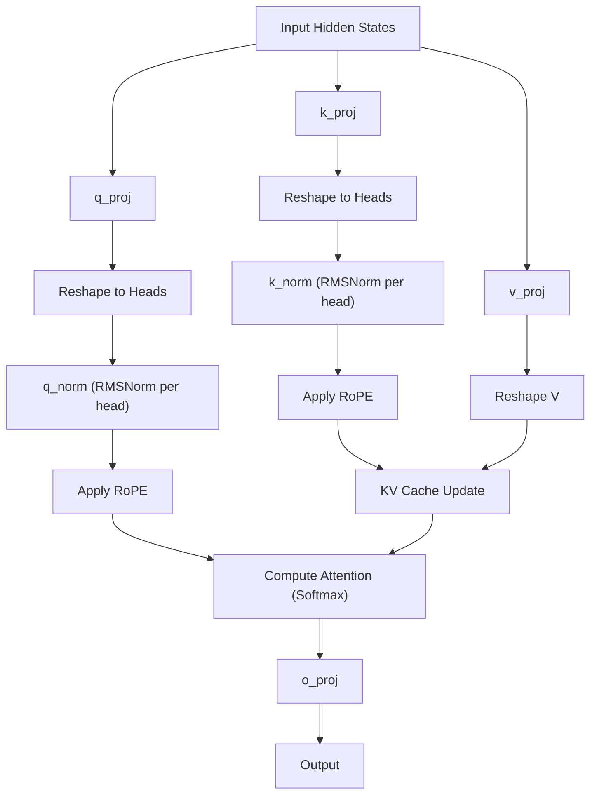
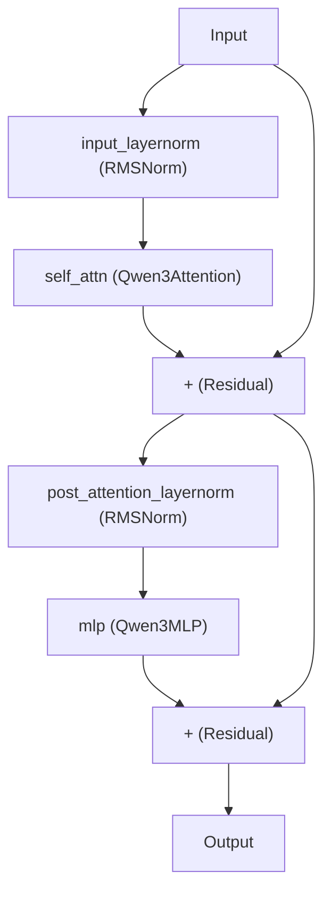

# Qwen3 模型结构与 C++ 实现参考文档

本文档基于 `modular_qwen3.py` 的源码，提炼了 Qwen3 模型的网络结构和计算图，旨在为后续的 C++（如 GGML / TensorRT-LLM / vLLM 引擎）推理实现提供清晰的参考。

---

## 1. 整体架构概览 (Overall Architecture)

Qwen3 采用了标准的自回归 Transformer 架构 (Causal LM)，但在注意力层和标准化层上引入了特定的设计（如 QK-Norm、混合滑动窗口注意力等）。

### 整体计算流程图

---

## 2. 核心模块解析 (Module Breakdown)

### 2.1 Qwen3RMSNorm (均方根层归一化)
不同于标准的 LayerNorm，RMSNorm 不计算均值，只计算均方根。
- **参数**: `weight` (shape: `[hidden_size]`), `eps` (防止除零的微小值)。
- **C++ 实现注意点**: 
  - 计算方差时，需将输入强制转换为 `float32` (FP32) 以保证精度，计算完毕后再转回原类型 (FP16/BF16)。
  - **公式**: $y = x \cdot \frac{1}{\sqrt{\text{mean}(x^2) + \epsilon}} \cdot weight$

### 2.2 Qwen3RotaryEmbedding (旋转位置编码 RoPE)
处理序列的位置信息，支持动态扩展和多种 RoPE 类型。
- **C++ 实现注意点**:
  - `rotate_half` 的逻辑是：将输入张量在最后一个维度切分为两半 `x1` 和 `x2`，然后拼接为 `[-x2, x1]`。
  - **公式**: 
    - $q_{embed} = (q \times \cos) + (\text{rotate\_half}(q) \times \sin)$
    - $k_{embed} = (k \times \cos) + (\text{rotate\_half}(k) \times \sin)$

### 2.3 Qwen3MLP (门控前馈神经网络)
采用 SwiGLU / ACT2FN 结构的 MLP，不使用偏置项。
- **参数**: `gate_proj`, `up_proj`, `down_proj` (均为 `bias=False`)。
- **C++ 实现注意点**:
  - 输入首先同时经过 `gate_proj` 和 `up_proj`。
  - 对 `gate_proj` 的结果应用激活函数 (通常是 SiLU)。
  - 二者逐元素相乘 (Element-wise multiplication) 后，再输入给 `down_proj`。
  - **公式**: $y = \text{down\_proj}(\text{ACT}(\text{gate\_proj}(x)) \odot \text{up\_proj}(x))$

### 2.4 Qwen3Attention (注意力机制) 🚨 **核心差异点**
Qwen3 的 Attention 结合了 GQA (Grouped Query Attention) 和 **QK-Norm**，并且根据层类型的不同，支持全局注意力和滑动窗口注意力。

- **参数**: 
  - 投影层: `q_proj`, `k_proj`, `v_proj`, `o_proj` (偏置取决于 `config.attention_bias`)。
  - **特有组件**: `q_norm` 和 `k_norm` (针对 `head_dim` 的 RMSNorm)。
- **C++ 实现注意点**:
  1. **QK-Norm 顺序**: 在 `q_proj` 和 `k_proj` 之后，**在应用 RoPE 之前**，需要对 Q 和 K 进行 RMSNorm。这个 Norm 是在 `head_dim` 维度上进行的（而非整个 `hidden_size`）。
  2. **GQA 处理**: 在计算 Attention 分数前，需要使用 `repeat_kv` 将 K 和 V 扩展到与 Q 相同的头数。
  3. **滑动窗口 (Sliding Window)**: 模型配置文件 `config.layer_types` 决定了当前层是 `full_attention` 还是 `sliding_attention`。在 C++ 构建 Attention 算子（如 FlashAttention）时，需根据该层的配置传入 `window_size`。

### 2.5 Qwen3DecoderLayer (单层解码器)
标准的 Pre-Norm 结构残差块。

---

## 3. C++ 推理引擎实现 CheckList (避坑指南)

在编写 C++ 代码（如使用 CUDA/C++ 实现算子）时，请务必检查以下 Qwen3 的特有设计：

1. **QK-Norm (头维度归一化)**:
   - 传统的 LLaMA 架构没有 `q_norm` 和 `k_norm`。Qwen3 中，`q_proj` 输出后的 shape 从 `[batch, seq, num_heads * head_dim]` view 成了 `[batch, seq, num_heads, head_dim]` 后，对最后一个维度 `head_dim` 执行了一次 RMSNorm。C++ 编写算子融合 (Fused Kernel) 时必须把这个操作加在 RoPE 之前。
2. **混合 Attention 模式 (Hybrid Attention)**:
   - 掩码 (Attention Mask) 生成逻辑中包含了 `causal_mask_mapping`。需要支持在同一模型中，**部分层是全局因果注意力，部分层是局部滑动窗口因果注意力**。C++ 的 KV Cache 管理和 Flash Attention 接口需支持传入 `sliding_window` 参数。
3. **Weight Tying (权重共享)**:
   - 观察 `Qwen3ForCausalLM` 的 `_tied_weights_keys`，`lm_head.weight` 等同于 `model.embed_tokens.weight`。在 C++ 加载权重 (safetensors/bin) 时，如果只存了一份，需要将指针指向同一块显存，或进行别名映射。
4. **精度敏感操作**:
   - `RMSNorm` 和 `RoPE` 的三角函数计算，在 C++ 代码中**必须强制提升至 FP32** (对应 Python 代码中的 `with maybe_autocast(..., enabled=False)` 和 `to(torch.float32)`)，以避免在长文本生成时出现 NaN 或严重的精度退化。
