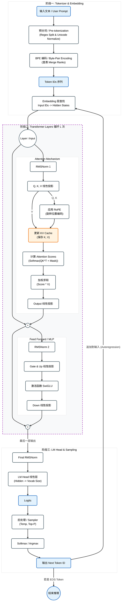

```mermaid
%%{
  init: {
    'theme': 'base',
    'themeVariables': {
      'primaryColor': '#fff',
      'primaryBorderColor': '#333',
      'lineColor': '#333',
      'fontSize': '14px',
      'fontFamily': 'arial'
    }
  }
}%%

graph TD
    %% --- 样式定义 (Style Definitions) ---
    %% 1. IO节点: 浅蓝背景，深蓝边框，纯黑文字
    classDef io fill:#e3f2fd,stroke:#1565c0,stroke-width:2px,color:#000,rx:5,ry:5;
    
    %% 2. 处理节点: 纯白背景，深灰边框 (极简风)，纯黑文字
    classDef process fill:#ffffff,stroke:#455a64,stroke-width:2px,color:#000,rx:5,ry:5;
    
    %% 3. 记忆/缓存节点: 浅橙背景，深橙边框，纯黑文字
    classDef memory fill:#fff3e0,stroke:#ef6c00,stroke-width:2px,color:#000,rx:5,ry:5;
    
    %% 4. 循环块背景: 极淡的灰紫色，虚线
    classDef loopBlock fill:#f8f9fa,stroke:#9c27b0,stroke-width:2px,stroke-dasharray: 5 5,color:#000;

    %% --- 1. 预处理与分词阶段 ---
    subgraph Tokenizer_Stage [阶段一: Tokenizer & Embedding]
        direction TB
        Input(输入文本 / User Prompt):::io
        --> PreToken["预分词 / Pre-tokenization<br/>(Regex Split & Unicode Normalize)"]:::process
        --> BPE["BPE 编码 / Byte-Pair Encoding<br/>(查表 Merge Ranks)"]:::process
        --> TokenIDs[Token IDs 序列]:::io
        --> EmbedLookup["Embedding 层查找<br/>Input IDs -> Hidden States"]:::process
    end

    %% --- 2. Transformer 层循环 ---
    subgraph Transformer_Blocks [阶段二: Transformer Layers 循环 L 次]
        direction TB
        
        %% 层输入节点
        BlockStart((Layer i Input)):::process
        
        %% Attention 块
        subgraph Attn_Block [Attention Mechanism]
            direction TB
            RMS1[RMSNorm 1]:::process
            QKV_Proj["Q, K, V 线性投影"]:::process
            RoPE["应用 RoPE<br/>(旋转位置编码)"]:::process
            CacheOp["更新 KV Cache<br/>(保存 K, V)"]:::memory
            AttnScore["计算 Attention Scores<br/>(Softmax(QK^T + Mask))"]:::process
            WeightedSum["加权求和<br/>(Score * V)"]:::process
            Out_Proj["Output 线性投影"]:::process
            
            %% Attn 内部连接
            RMS1 --> QKV_Proj
            QKV_Proj -- Q, K --> RoPE
            QKV_Proj -- V --> CacheOp
            RoPE --> CacheOp
            CacheOp --> AttnScore
            AttnScore --> WeightedSum
            WeightedSum --> Out_Proj
        end
        
        %% 残差连接节点 1
        ResAdd1((+)):::process

        %% FFN 块
        subgraph FFN_Block [Feed Forward / MLP]
            direction TB
            RMS2[RMSNorm 2]:::process
            GateUp["Gate & Up 线性投影"]:::process
            SwiGLU["激活函数 SwiGLU"]:::process
            Down["Down 线性投影"]:::process
            
            %% FFN 内部连接
            RMS2 --> GateUp
            GateUp --> SwiGLU
            SwiGLU --> Down
        end

        %% 残差连接节点 2
        ResAdd2((+)):::process

        %% Transformer 层级内部的跨块连接
        BlockStart --> RMS1
        BlockStart --> ResAdd1
        Out_Proj --> ResAdd1
        
        ResAdd1 --> RMS2
        ResAdd1 --> ResAdd2
        Down --> ResAdd2
    end
    
    %% 应用样式到子图
    class Transformer_Blocks loopBlock

    %% --- 3. 输出与采样阶段 ---
    subgraph Output_Stage [阶段三: LM Head & Sampling]
        direction TB
        FinalRMS[Final RMSNorm]:::process
        LM_Head["LM Head 线性层<br/>(Hidden -> Vocab Size)"]:::process
        Logits[Logits]:::io
        PostProcess["后处理 / Sampler<br/>(Temp, Top-P)"]:::process
        SoftmaxFinal[Softmax / Argmax]:::process
        NextToken[输出 Next Token ID]:::io

        %% Output 内部连接
        FinalRMS --> LM_Head
        LM_Head --> Logits
        Logits --> PostProcess
        PostProcess --> SoftmaxFinal
        SoftmaxFinal --> NextToken
    end

    %% --- 4. 全局连接 ---
    EmbedLookup --> BlockStart
    ResAdd2 -- 最后一层输出 --> FinalRMS

    %% 自回归循环
    NextToken -- "追加到输入 (Autoregression)" --> EmbedLookup
    NextToken -- "若是 EOS Token" --> Stop((结束推理)):::io

    %% 全局连线样式加强
    linkStyle default stroke:#333,stroke-width:2px;
```
