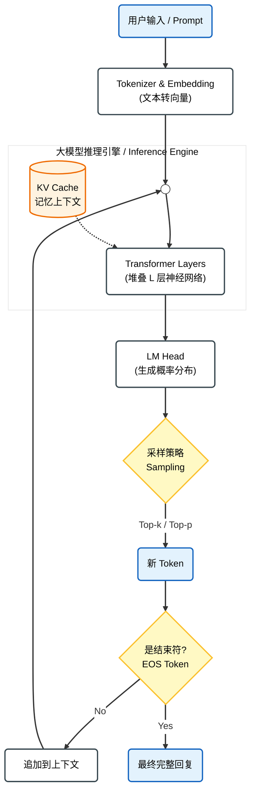

```mermaid
%%{
  init: {
    'theme': 'base',
    'themeVariables': {
      'primaryColor': '#fff',
      'primaryBorderColor': '#333',
      'lineColor': '#333',
      'fontSize': '15px',
      'fontFamily': 'arial'
    }
  }
}%%

graph TD
    %% --- 样式定义 ---
    classDef data fill:#e3f2fd,stroke:#1565c0,stroke-width:2px,color:#000,rx:5,ry:5;
    classDef model fill:#ffffff,stroke:#37474f,stroke-width:2px,color:#000,rx:5,ry:5;
    classDef memory fill:#fff3e0,stroke:#ef6c00,stroke-width:2px,color:#000;
    classDef logic fill:#fff9c4,stroke:#fbc02d,stroke-width:2px,color:#000,rx:5,ry:5;

    %% --- 主流程 ---
    
    %% 1. 输入处理
    Input("用户输入 / Prompt"):::data --> Tokenizer["Tokenizer & Embedding<br/>(文本转向量)"]:::model
    
    %% 2. 核心模型黑盒
    subgraph Model_Engine [大模型推理引擎 / Inference Engine]
        direction TB
        
        %% 循环入口
        LoopStart(( )) 
        
        %% KV Cache 侧挂 (使用圆柱体语法)
        KVCache[("KV Cache<br/>记忆上下文")]:::memory
        
        %% 堆叠层
        TransStack["Transformer Layers<br/>(堆叠 L 层神经网络)"]:::model
        
        %% 连接关系
        LoopStart --> TransStack
        
        %% 【修复点】将出错的双向虚线改为标准的单向虚线连接
        %% 含义：KV Cache 注入信息给 Transformer
        KVCache -.-> TransStack
    end

    Tokenizer --> LoopStart

    %% 3. 输出生成
    TransStack --> Logits["LM Head<br/>(生成概率分布)"]:::model
    Logits --> Sampler{"采样策略<br/>Sampling"}:::logic
    
    %% 4. 判定与循环
    Sampler -->|Top-k / Top-p| NewToken(新 Token):::data
    
    NewToken --> IsEnd{"是结束符?<br/>EOS Token"}:::logic
    
    IsEnd -- No --> Append[追加到上下文]:::model
    Append --> LoopStart
    
    IsEnd -- Yes --> FinalOutput(最终完整回复):::data

    %% --- 样式微调 ---
    linkStyle default stroke-width:2px;
```

```mermaid
%%{
  init: {
    'theme': 'base',
    'themeVariables': {
      'primaryColor': '#fff',
      'primaryBorderColor': '#333',
      'lineColor': '#333',
      'fontSize': '14px',
      'fontFamily': 'arial, sans-serif'
    }
  }
}%%

graph TD
    %% --- 样式定义 ---
    %% 1. IO节点: 淡蓝背景，深蓝边框 (数据流)
    classDef io fill:#e3f2fd,stroke:#1565c0,stroke-width:2px,color:#000,rx:5,ry:5;
    
    %% 2. 通用处理节点: 纯白背景，岩石灰边框 (计算逻辑)
    classDef process fill:#ffffff,stroke:#455a64,stroke-width:2px,color:#000,rx:5,ry:5;
    
    %% 3. Qwen特有/关键节点: 淡紫背景 (强调架构差异)
    classDef special fill:#f3e5f5,stroke:#7b1fa2,stroke-width:2px,color:#000,rx:5,ry:5;
    
    %% 4. 记忆/缓存节点: 淡橙背景，深橙边框 (副作用/状态)
    classDef memory fill:#fff3e0,stroke:#ef6c00,stroke-width:2px,color:#000,rx:5,ry:5;
    
    %% 5. 循环容器背景
    classDef loopBlock fill:#f8f9fa,stroke:#9c27b0,stroke-width:2px,stroke-dasharray: 5 5,color:#000;

    %% --- 1. 预处理阶段 ---
    subgraph Tokenizer_Stage [阶段一: Tokenizer & Embedding]
        direction TB
        Input(输入文本 / User Prompt):::io
        --> PreToken["预分词 / Pre-tokenization"]:::process
        --> BPE["BPE 编码"]:::process
        --> EmbedLookup["Embedding 层<br/>Input IDs -> Hidden States"]:::process
    end

    %% --- 2. Transformer 层循环 ---
    %% 修复点：将英文括号 ( ) 改为中文全角括号 （ ），避免解析错误
    subgraph Transformer_Blocks [阶段二: Qwen3 Transformer Layer（循环 L 次）]
        direction TB
        
        %% 层输入
        BlockStart((Layer Input)):::process
        
        %% --- Attention 块 (Qwen3 特有逻辑) ---
        subgraph Attn_Block [Attention Mechanism]
            direction TB
            RMS1[RMSNorm 1]:::process
            QKV_Proj["Q, K, V Linear Proj"]:::process
            
            %% Qwen 特有: QK-Norm
            Q_Norm["Q-Norm (RMS)"]:::special
            K_Norm["K-Norm (RMS)"]:::special
            
            RoPE["应用 RoPE<br/>(旋转位置编码)"]:::process
            
            %% Cache 逻辑: 存入 RoPE 后的 K 和 原始 V
            CacheOp["KV Cache<br/>(Update & Retrieve)"]:::memory
            
            AttnScore["计算 Attention Scores<br/>Softmax(QK^T + Mask)"]:::process
            WeightedSum["加权求和 (Score * V)"]:::process
            Out_Proj["Output Linear Proj"]:::process
            
            %% 内部连线
            RMS1 --> QKV_Proj
            
            %% 分流：Q 和 K 经过 Norm，V 直接走
            QKV_Proj -- Q --> Q_Norm
            QKV_Proj -- K --> K_Norm
            QKV_Proj -- V --> CacheOp
            
            %% RoPE 计算
            Q_Norm --> RoPE
            K_Norm --> RoPE
            
            %% 关键修正: K 在 RoPE 之后才存入 Cache
            RoPE -- Rotated K --> CacheOp
            RoPE -- Rotated Q --> AttnScore
            
            %% 计算 Attention
            CacheOp -- "History K (Rotated)" --> AttnScore
            CacheOp -- "History V" --> WeightedSum
            AttnScore --> WeightedSum
            WeightedSum --> Out_Proj
        end
        
        %% 残差连接 1
        ResAdd1((+)):::process

        %% --- FFN 块 (SwiGLU) ---
        subgraph FFN_Block [Feed Forward / MLP]
            direction TB
            RMS2[RMSNorm 2]:::process
            GateUp["Gate & Up Proj"]:::process
            SwiGLU["SwiGLU 激活<br/>(SiLU(Gate) * Up)"]:::process
            Down["Down Proj"]:::process
            
            RMS2 --> GateUp
            GateUp --> SwiGLU
            SwiGLU --> Down
        end

        %% 残差连接 2
        ResAdd2((+)):::process

        %% 层级连线
        BlockStart --> RMS1
        BlockStart --> ResAdd1
        Out_Proj --> ResAdd1
        
        ResAdd1 --> RMS2
        ResAdd1 --> ResAdd2
        Down --> ResAdd2
    end
    
    class Transformer_Blocks loopBlock

    %% --- 3. 输出阶段 ---
    subgraph Output_Stage [阶段三: LM Head & Sampling]
        direction TB
        FinalRMS[Final RMSNorm]:::process
        LM_Head["LM Head<br/>(Hidden -> Vocab)"]:::process
        Logits[Logits]:::io
        Sampler["采样 / Sampler<br/>(Temp, Top-P, Softmax)"]:::process
        NextToken[输出 Next Token ID]:::io

        FinalRMS --> LM_Head
        LM_Head --> Logits
        Logits --> Sampler
        Sampler --> NextToken
    end

    %% --- 4. 全局连接 ---
    EmbedLookup --> BlockStart
    ResAdd2 -- 最后一层输出 --> FinalRMS

    %% 自回归循环
    NextToken -- "追加到输入 (Autoregression)" --> EmbedLookup
    NextToken -- "EOS Token" --> Stop((结束)):::io

    %% 连线样式
    linkStyle default stroke:#333,stroke-width:2px;
```
