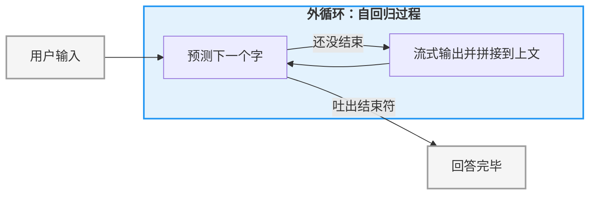
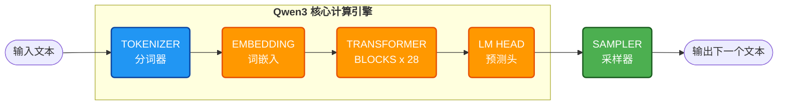

# 第 1 章：架构总览 —— 大模型推理引擎的架构全景

在写下第一行 C++ 代码之前，我们先跳出具体的算法细节，从宏观视角看一看：**当我们给大模型发送一段文字时，程序内部究竟经历了一场怎样的旅程？**

理解了这个全局流程，你就理解了整个工程的模块划分。

### 1.1 自回归的“外循环”

大模型（LLM）的推理本质上是一个**自回归（Autoregressive）**的过程。简单来说，它就是一个**根据上文猜下一个字**的循环游戏：

1.  **输入**：你输入“你好”。
2.  **预测**：模型基于“你好”，预测下一个字概率最大的是“吗”。
3.  **拼接**：模型把“吗”拼到后面，变成“你好吗”。
4.  **循环**：再次预测下一个字是“？”。
5.  **终止**：直到模型吐出一个特殊的结束标志（如 `<|im_end|>`），游戏结束。

这个过程可以用下面的流程图表示：

**关键点**：这个外循环决定了“对话”是如何进行的，它的核心逻辑在 **`预测下一个字`** 中。

### 1.2 推理引擎的内部结构

我们将 **`预测下一个字`** 这个方框展开，这就是我们要实现的四大部分：

#### 核心组件功能拆解：

1.  **分词器 (Tokenizer)**：**语言的翻译官**。
    *   **职责**：计算机不认识文字，只认识数字。它负责把“你好”拆解成模型理解的数字 ID（如 `[108386, 103924]`），最后再把模型预测出的数字还原回文字。

2.  **词嵌入 (Embedding)**：**数字的具象化**。
    *   **职责**：Token ID 只是个索引，模型无法直接计算。Embedding 层像查字典一样，把每个数字 ID 变成一组包含语义信息的**高维向量**。

3.  **转换器 (Transformer Blocks)**：**计算的核心**。
    *   **职责**：这是最硬核的部分。Qwen3-0.6B 堆叠了 28 层这样的计算块。数据在这里通过 **Attention（注意力机制）** 捕捉上下文联系，通过 **MLP（前馈网络）** 进行深层语义加工。

4.  **语言模型头 (LM Head)**：**最后的预测器**。
    *   **职责**：将 Transformer 输出的抽象向量，映射回对词表中每一个字的“概率分布”。它告诉我们：根据目前的上文，下一个字是“吗”的概率是 90%，是“吧”的概率是 5%。

---

下一章，我们将正式开始搭建开发环境

