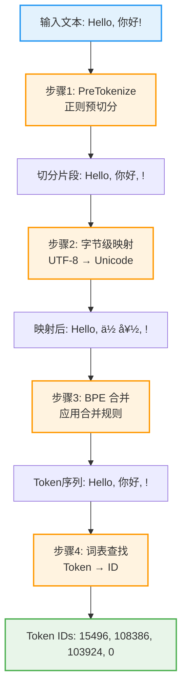
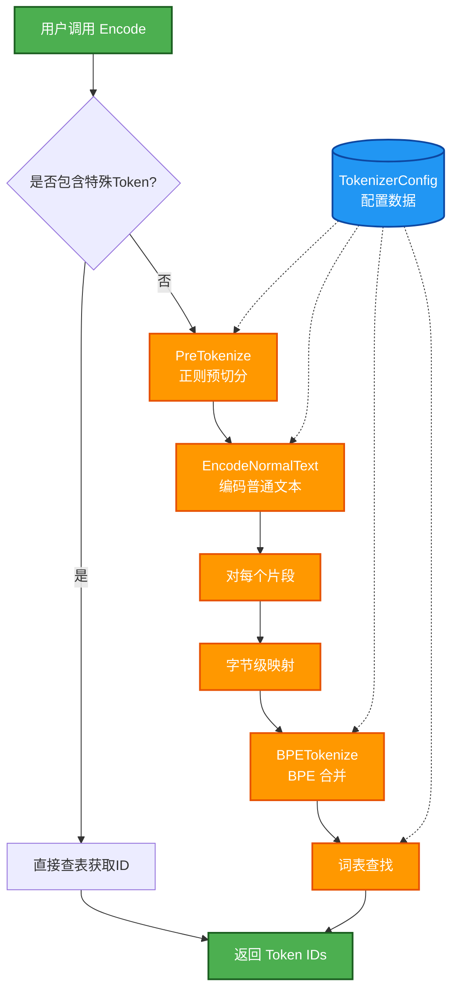
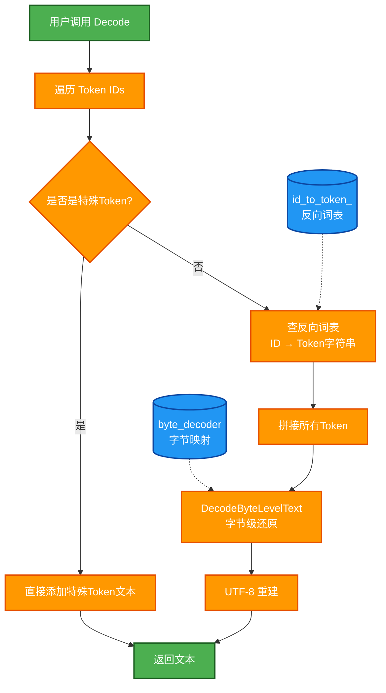

# 第 4 章：分词引擎（Tokenizer）—— 文本与数字的桥梁

在上一章，我们实现了张量（Tensor）这个数据容器。从这一章开始，我们要实现推理引擎的第一个"功能模块"：**分词器（Tokenizer）**。

它是连接人类语言和模型计算的桥梁——把你输入的文字变成模型能理解的数字，再把模型输出的数字还原成你能读懂的文字。

---

## 4.1 分词器是什么？为什么需要它？

### 4.1.1 从文字到数字的必要性

计算机的世界里只有 0 和 1，它不认识"你好"，也不认识"Hello"。但神经网络需要对这些文字进行数学运算（矩阵乘法、加法等），所以我们必须把文字转换成数字。

**一个完整的对话流程**：

```
用户输入："你好"
    ↓
[Tokenizer.Encode]  把文字变成数字
    ↓
Token IDs: [108386, 103924]
    ↓
[Model.Forward]  模型计算
    ↓
预测的 Token ID: 103924
    ↓
[Tokenizer.Decode]  把数字还原成文字
    ↓
模型输出："吗"
```

分词器就是这个流程中的"翻译官"，负责文字和数字之间的双向转换。

### 4.1.2 分词器在推理流程中的位置

回顾第 1 章的架构图，分词器是整个推理引擎的"入口"和"出口"：


**关键点**：
- **编码（Encode）**：文本 → Token IDs
- **解码（Decode）**：Token IDs → 文本

### 4.1.3 三种分词方案的对比

在实现分词器之前，我们先了解一下业界常见的三种分词方案：

| 方案 | 原理 | 优点 | 缺点 | 代表模型 |
|------|------|------|------|----------|
| **字符级** | 每个字符一个 token | 词表小（几百个） | 序列太长，难以捕捉语义 | 早期 RNN |
| **词级** | 每个词一个 token | 语义完整 | 词表巨大（几十万），OOV 问题严重 | 传统 NLP |
| **子词级（BPE）** | 高频字符对合并成子词 | 平衡词表大小与表达能力 | 实现稍复杂 | GPT、Qwen |

**Qwen3 使用的方案**：**Byte-level BPE（字节级字节对编码）**
- 词表大小：**151,936** 个 token
- 既能处理常见词（如 "hello" 是一个 token），也能处理罕见词（拆成多个子词）
- 通过字节级映射，可以处理任意 Unicode 字符（中文、emoji 等）

---

## 4.2 BPE 编码原理：从文本到 Token IDs

### 4.2.1 编码流程总览

在深入细节之前，我们先看看完整的编码流程。从用户输入的文本到最终的 Token IDs，需要经过以下 4 个步骤：



接下来，我们逐步拆解每个步骤。

### 4.2.2 步骤 1：PreTokenize（正则预切分）

**为什么需要预切分？**

如果直接对整段文本进行 BPE 编码，会遇到问题：
- 空格、标点会和单词混在一起
- 中英文、数字之间的边界不清晰

**PreTokenize 的作用**：用正则表达式把文本切分成更小的片段，每个片段独立进行 BPE 编码。

**示例：**

```
输入: "Hello, 世界! 123"
    ↓ [正则切分]
输出: ["Hello", ",", " ", "世界", "!", " ", "123"]
```

**Qwen3 使用的正则表达式**（简化理解）：
- 匹配英文单词（连续字母）
- 匹配数字（1-3 位）
- 匹配标点符号
- 匹配空格和换行

**关键点**：每个切分出来的片段，会独立进行后续的 BPE 编码。

### 4.2.3 步骤 2：字节级映射（Byte-level Encoding）

**为什么需要字节级映射？**

中文、emoji 等 Unicode 字符可能不在基础词表中。为了保证任意字符都能编码，我们先把字符转换成字节，再映射到可打印字符。

**映射过程：**

```
步骤 1：UTF-8 编码
"你" → 字节: [0xE4, 0xBD, 0xA0]

步骤 2：字节映射到可打印字符
0xE4 → "ä"
0xBD → "½"
0xA0 → " "

结果: "ä½ "
```

**为什么要映射？**
- 直接用字节值（0x00-0xFF）会包含不可打印的控制字符
- 映射后都变成可打印字符，方便处理

### 4.2.4 步骤 3：BPE 合并（核心算法）

**BPE（Byte Pair Encoding）** 的核心思想：

> **高频出现的字符对，优先合并成一个新的 token。**

**训练阶段**（我们不需要实现）：
- 统计字符对出现频率
- 把高频字符对合并成新 token
- 得到词表（Vocab）和合并规则（Merges）

**推理阶段**（我们要实现的）：
- 按照训练好的合并规则，把文本切分成 token 序列

**示例：编码单词 "hello"**

假设我们已经训练好了以下合并规则（数字越小，优先级越高）：

```
合并规则表（Merges）：
规则 1: ("l", "l") → "ll"     [优先级: 50]
规则 2: ("h", "e") → "he"     [优先级: 100]
规则 3: ("he", "ll") → "hell" [优先级: 200]
```

**编码步骤：**

```
步骤 0：初始状态（每个字符独立）
["h", "e", "l", "l", "o"]

步骤 1：应用规则 1（优先级最高）
找到相邻的 ("l", "l")，合并成 "ll"
["h", "e", "ll", "o"]

步骤 2：应用规则 2
找到相邻的 ("h", "e")，合并成 "he"
["he", "ll", "o"]

步骤 3：应用规则 3
找到相邻的 ("he", "ll")，合并成 "hell"
["hell", "o"]

步骤 4：无法继续合并
最终结果: ["hell", "o"]
```

**关键点**：
- BPE 是一个**贪心算法**，每次选择优先级最高的规则进行合并
- 合并是**迭代进行**的，直到没有规则可以应用为止

### 4.2.5 步骤 4：词表查找

经过 BPE 合并后，我们得到了一个 token 序列（如 `["hell", "o"]`）。最后一步是把每个 token 字符串转换成对应的 ID。

**示例：**

```
Token 序列: ["hell", "o"]
    ↓
查词表（Vocab）
    ↓
"hell" → Token ID: 12345
"o"    → Token ID: 78
    ↓
最终输出: [12345, 78]
```

**词表（Vocab）** 是一个字典，存储了所有 token 及其对应的 ID：

```
{
  "hello": 15496,
  "hell": 12345,
  "o": 78,
  "你": 108386,
  "好": 103924,
  ...
}
```

### 4.2.6 完整示例：编码 "Hello, 你好!"

现在我们把所有步骤串起来，看一个完整的例子：

```
输入文本: "Hello, 你好!"

步骤 1：PreTokenize（正则预切分）
["Hello", ",", " ", "你好", "!"]

步骤 2：字节级映射（对每个片段）
"Hello" → "Hello"（ASCII 字符不变）
","     → ","
" "     → " "
"你好"  → "ä½ å¥½"（UTF-8 字节映射）
"!"     → "!"

步骤 3：BPE 合并（对每个片段）
"Hello" → ["Hello"]（假设整个词在词表中）
","     → [","]
" "     → [" "]
"ä½ å¥½" → ["ä½ ", "好"]（假设"你"和"好"分别在词表中）
"!"     → ["!"]

步骤 4：词表查找
"Hello" → 15496
","     → 11
" "     → 220
"ä½ "  → 108386（对应"你"）
"好"  → 103924（对应"好"）
"!"     → 0

最终输出: [15496, 11, 220, 108386, 103924, 0]
```

**小结**：
- **PreTokenize**：正则切分，确定边界
- **字节级映射**：处理任意 Unicode 字符
- **BPE 合并**：高频字符对优先合并
- **词表查找**：Token 字符串 → Token ID

---

## 4.3 Tokenizer 的整体架构

理解了 BPE 编码原理后，我们来看看如何用 C++ 实现一个完整的 Tokenizer。

### 4.3.1 核心数据结构

在实现 Tokenizer 之前，我们需要先定义几个核心的数据结构。

**1. 词表（Vocab）**

词表是一个字典，存储 token 字符串到 ID 的映射：

```cpp
using Vocab = std::unordered_map<std::string, uint32_t>;

// 示例：
// {
//   "hello": 15496,
//   "world": 14957,
//   "你": 108386,
//   ...
// }
```

**2. 合并规则（Merges）**

合并规则是一个列表，存储所有的字符对合并操作：

```cpp
using Merges = std::vector<std::pair<std::string, std::string>>;

// 示例：
// [
//   ("h", "e"),      // 第 0 条规则
//   ("l", "l"),      // 第 1 条规则
//   ("he", "ll"),    // 第 2 条规则
//   ...
// ]
```

**3. BPE 优先级（BPE Ranks）**

为了快速查找合并规则的优先级，我们需要一个映射表：

```cpp
std::map<std::pair<std::string, std::string>, int> bpe_ranks;

// 示例：
// {
//   ("h", "e"): 0,      // 优先级 0（最高）
//   ("l", "l"): 1,
//   ("he", "ll"): 2,
//   ...
// }
```

**4. 字节编码器（Byte Encoder）**

字节到 Unicode 字符的映射表：

```cpp
std::map<unsigned char, std::string> byte_encoder;

// 示例：
// {
//   0xE4: "ä",
//   0xBD: "½",
//   0xA0: " ",
//   ...
// }
```

**5. 特殊 Token**

特殊 token（如 `<|im_start|>`、`<|im_end|>`）需要单独处理：

```cpp
struct AddedToken {
    int id;
    std::string content;
    bool special;  // 是否是特殊 token
};

// 示例：
// {
//   id: 151643,
//   content: "<|im_start|>",
//   special: true
// }
```

**6. TokenizerConfig**

把所有配置数据封装到一个结构体中：

```cpp
struct TokenizerConfig {
    Vocab vocab;                                          // 词表
    Merges merges;                                        // 合并规则列表
    std::map<std::pair<std::string, std::string>, int> bpe_ranks;  // 优先级
    std::vector<AddedToken> added_tokens;                 // 特殊 token
    std::wstring pre_tokenizer_pattern;                   // 预切分正则
    std::map<unsigned char, std::string> byte_encoder;    // 字节映射
};
```

### 4.3.2 Tokenizer 类的设计

现在我们来设计 Tokenizer 类的接口：

```cpp
class Tokenizer {
public:
    Tokenizer() = default;

    // 加载配置文件（tokenizer.json）
    void LoadConfig(const std::string& config_file);

    // 编码：文本 → Token IDs
    std::vector<uint32_t> Encode(const std::string& text);

    // 解码：Token IDs → 文本
    std::string Decode(const std::vector<uint32_t>& token_ids);

private:
    TokenizerConfig config_;                              // 配置数据
    std::unordered_map<uint32_t, std::string> id_to_token_;  // 反向词表
    std::unordered_set<uint32_t> special_token_ids_;      // 特殊 token ID 集合

    // 辅助方法
    std::vector<std::wstring> PreTokenize(const std::wstring& text);
    void EncodeNormalText(const std::string& text, std::vector<uint32_t>& ids);
    void BPETokenize(const std::string& utf8_word, std::vector<uint32_t>& tokens);
    std::string DecodeByteLevelText(const std::string& byte_level_text);
};
```

**为什么 `PreTokenize` 使用 `wstring` 而不是 `string`？**

C++ 的 `std::string` 本质上是字节数组，它不理解 Unicode。一个中文字符在 UTF-8 下占 3 个字节，如果用 `string` 做正则匹配，`\p{L}`（匹配字母）、`\p{N}`（匹配数字）这类 Unicode 属性类就无法正确工作——它只会看到一堆字节，不知道哪里是一个字符的边界。

`std::wstring` 存储的是宽字符（`wchar_t`），在 Linux 下每个 `wchar_t` 占 4 字节，可以直接存储一个 Unicode 码点。这样正则引擎就能正确识别"这是一个中文字符"，而不是"这是三个字节"。

```
std::string  "你好" → [0xE4, 0xBD, 0xA0, 0xE5, 0xA5, 0xBD]  6个字节，正则看不懂
std::wstring "你好" → [0x4F60, 0x597D]                       2个宽字符，正则能正确处理
```

所以编码流程是：
```
string (UTF-8) → UTF8ToWide() → wstring → 正则预切分 → WideToUTF8() → string (UTF-8)
```
```

**关键点**：
- **公开接口**：只暴露 `LoadConfig`、`Encode`、`Decode` 三个方法
- **私有数据**：配置数据和辅助映射表
- **辅助方法**：把复杂的编码流程拆分成多个小函数

### 4.3.3 编码流程架构图

现在我们把 Tokenizer 的编码流程用架构图表示出来：



**流程说明**：
1. 用户调用 `Encode(text)`
2. 检查是否包含特殊 token（如 `<|im_start|>`）
3. 如果有特殊 token，直接查表获取 ID
4. 如果是普通文本，进入编码流程：
   - PreTokenize：正则预切分
   - 对每个片段：字节级映射 → BPE 合并 → 词表查找
5. 返回 Token IDs

### 4.3.4 解码流程架构图

解码流程相对简单：



**流程说明**：
1. 用户调用 `Decode(token_ids)`
2. 遍历每个 Token ID
3. 查反向词表，获取 token 字符串
4. 拼接所有 token
5. 字节级还原：把映射后的字符还原成原始字节
6. UTF-8 重建：把字节序列转换成文本
7. 返回文本

---

## 4.4 实现编码流程（Encode）

现在我们来实现编码的核心逻辑。编码流程分为两部分：处理特殊 token 和处理普通文本。

### 4.4.1 主函数：Encode

`Encode` 函数负责扫描输入文本，识别特殊 token，并对普通文本进行编码：

```cpp
std::vector<uint32_t> Tokenizer::Encode(const std::string& text) {
    std::vector<uint32_t> ids;
    std::string normal_buffer;  // 缓存普通文本
    size_t pos = 0;

    while (pos < text.size()) {
        bool matched_special = false;

        // 尝试匹配特殊 token
        for (const auto& added_token : config_.added_tokens) {
            if (added_token.content.empty() ||
                pos + added_token.content.size() > text.size()) {
                continue;
            }

            // 检查是否匹配
            if (text.compare(pos, added_token.content.size(),
                           added_token.content) == 0) {
                // 先编码缓存的普通文本
                EncodeNormalText(normal_buffer, ids);
                normal_buffer.clear();

                // 添加特殊 token ID
                ids.push_back(added_token.id);
                pos += added_token.content.size();
                matched_special = true;
                break;
            }
        }

        // 如果没有匹配到特殊 token，累积到普通文本缓存
        if (!matched_special) {
            normal_buffer.push_back(text[pos]);
            ++pos;
        }
    }

    // 编码剩余的普通文本
    EncodeNormalText(normal_buffer, ids);
    return ids;
}
```

**关键点**：
- 逐字符扫描输入文本
- 优先匹配特殊 token（如 `<|im_start|>`）
- 普通文本累积到 `normal_buffer`，遇到特殊 token 时才编码
- 最后编码剩余的普通文本

### 4.4.2 编码普通文本：EncodeNormalText

这个函数负责对普通文本进行 PreTokenize 和 BPE 编码：

```cpp
void Tokenizer::EncodeNormalText(const std::string& text,
                                 std::vector<uint32_t>& ids) {
    if (text.empty()) return;

    // 步骤 1：UTF-8 → wstring（为了正则匹配）
    std::wstring wtext = UTF8ToWide(text);

    // 步骤 2：PreTokenize（正则预切分）
    std::vector<std::wstring> pre_tokens = PreTokenize(wtext);

    // 步骤 3：对每个片段进行 BPE 编码
    for (const auto& w : pre_tokens) {
        std::string utf8_part = WideToUTF8(w);
        BPETokenize(utf8_part, ids);
    }
}
```

**流程**：
```
UTF-8 string → wstring → PreTokenize → 多个 wstring 片段 →
逐个转回 UTF-8 → BPE 编码 → Token IDs
```

### 4.4.3 正则预切分：PreTokenize

使用 Boost.Regex 进行正则匹配：

```cpp
std::vector<std::wstring> Tokenizer::PreTokenize(const std::wstring& wtext) {
    boost::wregex re;
    try {
        re.assign(config_.pre_tokenizer_pattern, boost::regex::perl);
    } catch (const boost::regex_error& e) {
        std::cerr << "Regex Error: " << e.what() << std::endl;
        return {};
    }

    std::vector<std::wstring> tokens;
    boost::wsregex_token_iterator it(wtext.begin(), wtext.end(), re, 0);
    boost::wsregex_token_iterator end;

    for (; it != end; ++it) {
        tokens.push_back(it->str());
    }

    return tokens;
}
```

**关键点**：
- 使用 `boost::wregex` 处理宽字符
- `wsregex_token_iterator` 自动按正则模式切分文本

### 4.4.4 BPE 编码：BPETokenize

这是编码的核心算法，实现字节级映射和 BPE 合并：

```cpp
void Tokenizer::BPETokenize(const std::string& utf8_word,
                            std::vector<uint32_t>& tokens) {
    if (utf8_word.empty()) return;

    // 步骤 1：字节级映射
    std::vector<std::string> word_parts;
    std::string full_mapped_word = "";

    for (unsigned char c : utf8_word) {
        std::string mapped_char = config_.byte_encoder.at(c);
        word_parts.push_back(mapped_char);
        full_mapped_word += mapped_char;
    }

    // 步骤 2：尝试直接查词表（优化：整个词可能在词表中）
    if (config_.vocab.find(full_mapped_word) != config_.vocab.end()) {
        tokens.push_back(config_.vocab.at(full_mapped_word));
        return;
    }

    // 步骤 3：BPE 合并循环
    while (word_parts.size() > 1) {
        int min_rank = -1;
        int best_idx = -1;

        // 找到优先级最高的相邻字符对
        for (size_t i = 0; i < word_parts.size() - 1; ++i) {
            std::pair<std::string, std::string> pair =
                {word_parts[i], word_parts[i + 1]};

            auto it = config_.bpe_ranks.find(pair);
            if (it != config_.bpe_ranks.end()) {
                int rank = it->second;
                if (min_rank == -1 || rank < min_rank) {
                    min_rank = rank;
                    best_idx = i;
                }
            }
        }

        // 如果没有可合并的字符对，退出循环
        if (best_idx == -1) break;

        // 合并字符对
        word_parts[best_idx] = word_parts[best_idx] + word_parts[best_idx + 1];
        word_parts.erase(word_parts.begin() + best_idx + 1);
    }

    // 步骤 4：查词表，转换为 Token IDs
    for (const auto& part : word_parts) {
        auto it = config_.vocab.find(part);
        if (it != config_.vocab.end()) {
            tokens.push_back(it->second);
        } else {
            // 处理 OOV（词表外）情况
            std::cerr << "[UNK: " << part << "] ";
            tokens.push_back(0);  // 使用 UNK token
        }
    }
}
```

**算法步骤**：
1. **字节级映射**：把每个字节映射到 Unicode 字符
2. **直接查表优化**：如果整个词在词表中，直接返回
3. **BPE 合并循环**：
   - 遍历所有相邻字符对
   - 找到优先级最高的（rank 最小的）
   - 合并该字符对
   - 重复直到无法合并
4. **词表查找**：把每个 token 字符串转换为 ID

---

## 4.5 实现解码流程（Decode）

解码流程相对简单，主要是反向操作：Token IDs → Token 字符串 → 字节级还原 → UTF-8 文本。

### 4.5.1 主函数：Decode

```cpp
std::string Tokenizer::Decode(const std::vector<uint32_t>& token_ids) {
    std::string output;
    std::string byte_level_text;  // 缓存字节级文本

    for (uint32_t id : token_ids) {
        // 查反向词表
        auto it = id_to_token_.find(id);
        if (it == id_to_token_.end()) {
            continue;  // 跳过未知 ID
        }

        // 检查是否是特殊 token
        if (special_token_ids_.count(id)) {
            // 先还原缓存的字节级文本
            output += DecodeByteLevelText(byte_level_text);
            byte_level_text.clear();

            // 直接添加特殊 token 文本
            output += it->second;
        } else {
            // 累积普通 token 的字节级文本
            byte_level_text += it->second;
        }
    }

    // 还原剩余的字节级文本
    output += DecodeByteLevelText(byte_level_text);
    return output;
}
```

**关键点**：
- 特殊 token 直接添加，不需要字节级还原
- 普通 token 累积到 `byte_level_text`，最后统一还原

### 4.5.2 字节级还原：DecodeByteLevelText

这个函数把字节级映射后的字符还原成原始 UTF-8 字节：

```cpp
std::string Tokenizer::DecodeByteLevelText(const std::string& byte_level_text) {
    // 构建反向映射表（Unicode → 字节）
    static std::unordered_map<uint32_t, uint8_t> unicode_to_byte;
    if (unicode_to_byte.empty()) {
        int n = 0;
        for (int b = 0; b < 256; ++b) {
            bool is_direct = (b >= 33 && b <= 126) ||
                           (b >= 161 && b <= 172) ||
                           (b >= 174 && b <= 255);
            if (is_direct) {
                unicode_to_byte[b] = static_cast<uint8_t>(b);
            } else {
                unicode_to_byte[256 + n] = static_cast<uint8_t>(b);
                n++;
            }
        }
    }

    std::string raw_bytes_text;

    // 解析 UTF-8 编码的字符，提取 Unicode 码点
    for (size_t i = 0; i < byte_level_text.size();) {
        unsigned char c = byte_level_text[i];
        uint32_t cp = 0;  // Unicode 码点
        int bytes = 0;

        // 判断 UTF-8 字符占几个字节
        if (c <= 0x7F) {
            cp = c;
            bytes = 1;
        } else if ((c & 0xE0) == 0xC0) {
            cp = c & 0x1F;
            bytes = 2;
        } else if ((c & 0xF0) == 0xE0) {
            cp = c & 0x0F;
            bytes = 3;
        } else if ((c & 0xF8) == 0xF0) {
            cp = c & 0x07;
            bytes = 4;
        } else {
            cp = c;
            bytes = 1;
        }

        // 读取后续字节
        for (int j = 1; j < bytes && i + j < byte_level_text.size(); ++j) {
            cp = (cp << 6) | (byte_level_text[i + j] & 0x3F);
        }

        // 查反向映射表，还原原始字节
        if (unicode_to_byte.count(cp)) {
            raw_bytes_text.push_back(static_cast<char>(unicode_to_byte[cp]));
        }

        i += bytes;
    }

    return raw_bytes_text;
}
```

**流程**：
```
字节级文本（UTF-8 编码的 Unicode 字符）
    ↓
解析 UTF-8，提取 Unicode 码点
    ↓
查反向映射表（Unicode → 原始字节）
    ↓
原始 UTF-8 字节序列
```

---

## 4.6 加载配置文件（LoadConfig）

Tokenizer 的所有配置数据（词表、合并规则等）都存储在 `tokenizer.json` 文件中。

### 4.6.1 tokenizer.json 文件结构

```json
{
  "model": {
    "vocab": {
      "hello": 15496,
      "world": 14957,
      "你": 108386,
      ...
    },
    "merges": [
      ["h", "e"],
      ["l", "l"],
      ["he", "ll"],
      ...
    ]
  },
  "added_tokens": [
    {
      "id": 151643,
      "content": "<|im_start|>",
      "special": true
    },
    ...
  ]
}
```

### 4.6.2 LoadConfig 实现

```cpp
void Tokenizer::LoadConfig(const std::string& config_file) {
    try {
        // 读取 JSON 文件
        std::ifstream ifs(config_file);
        if (!ifs.good()) {
            std::cerr << "Failed to open config file: " << config_file << std::endl;
            return;
        }
        auto j = json::parse(ifs);

        // 1. 创建字节编码器
        config_.byte_encoder = CreateByteToUnicodeMap();

        // 2. 加载特殊 token
        config_.added_tokens = j.at("added_tokens")
                                .get<std::vector<AddedToken>>();

        // 3. 加载合并规则
        config_.merges = j.at("model").at("merges").get<Merges>();

        // 4. 构建 BPE 优先级映射
        for (size_t i = 0; i < config_.merges.size(); ++i) {
            std::string p1 = config_.merges[i].first;
            std::string p2 = config_.merges[i].second;
            config_.bpe_ranks[{p1, p2}] = (int)i;
        }

        // 5. 加载词表
        config_.vocab = j.at("model").at("vocab").get<Vocab>();

        // 6. 构建反向词表和特殊 token 集合
        id_to_token_.clear();
        special_token_ids_.clear();

        for (const auto& kv : config_.vocab) {
            id_to_token_[kv.second] = kv.first;
        }

        for (const auto& token : config_.added_tokens) {
            id_to_token_[static_cast<uint32_t>(token.id)] = token.content;
            if (token.special) {
                special_token_ids_.insert(static_cast<uint32_t>(token.id));
            }
        }

        // 7. 设置预切分正则表达式
        config_.pre_tokenizer_pattern =
            L"(?i:'s|'t|'re|'ve|'m|'ll|'d)|"
            L"[^\\r\\n[:alpha:][:digit:]]?[[:alpha:]]+|"
            L"[[:digit:]]|"
            L" ?[^\\s[:alpha:][:digit:]]+[\\r\\n]*|"
            L"\\s*[\\r\\n]+|"
            L"\\s+(?!\\S)|"
            L"\\s+";

    } catch (std::exception& e) {
        std::cerr << "Error loading tokenizer config: " << e.what() << std::endl;
    }
}
```

### 4.6.3 工具函数：CreateByteToUnicodeMap

创建字节到 Unicode 的映射表：

```cpp
std::map<unsigned char, std::string> CreateByteToUnicodeMap() {
    std::map<unsigned char, std::string> byte_encoder;
    std::vector<int> bs;

    // 包含可打印 ASCII 字符（33-126）
    for (int i = '!'; i <= '~'; ++i) bs.push_back(i);

    // 包含 Latin-1 补充字符
    for (int i = 161; i <= 172; ++i) bs.push_back(i);
    for (int i = 174; i <= 255; ++i) bs.push_back(i);

    std::vector<int> cs = bs;
    int n = 0;

    // 为剩余字节分配唯一的 Unicode 字符
    for (int b = 0; b < 256; ++b) {
        if (std::find(bs.begin(), bs.end(), b) == bs.end()) {
            bs.push_back(b);
            cs.push_back(256 + n);
            n++;
        }
    }

    // 构建映射：字节值 → UTF-8 字符串
    for (size_t i = 0; i < bs.size(); ++i) {
        unsigned char byte_val = static_cast<unsigned char>(bs[i]);
        int unicode_val = cs[i];

        // 将 Unicode 码点转换为 UTF-8 编码
        std::string utf8_char;
        if (unicode_val < 0x80) {
            utf8_char += (char)unicode_val;
        } else if (unicode_val < 0x800) {
            utf8_char += (char)(0xC0 | (unicode_val >> 6));
            utf8_char += (char)(0x80 | (unicode_val & 0x3F));
        } else {
            utf8_char += (char)(0xE0 | (unicode_val >> 12));
            utf8_char += (char)(0x80 | ((unicode_val >> 6) & 0x3F));
            utf8_char += (char)(0x80 | (unicode_val & 0x3F));
        }

        byte_encoder[byte_val] = utf8_char;
    }

    return byte_encoder;
}
```

---

## 4.7 完整代码

### 4.7.1 头文件：tokenizer.h

在 `src/tokenizer.h` 中定义所有数据结构和接口：

```cpp
#pragma once
#include <map>
#include <string>
#include <unordered_map>
#include <unordered_set>
#include <vector>
#include "nlohmann/json.hpp"

// 特殊 Token 结构
struct AddedToken {
    int id;
    std::string content;
    bool special;
};

NLOHMANN_DEFINE_TYPE_NON_INTRUSIVE(AddedToken, id, content, special)

// 类型别名
using Vocab = std::unordered_map<std::string, uint32_t>;
using Merges = std::vector<std::pair<std::string, std::string>>;

// Tokenizer 配置
struct TokenizerConfig {
    Vocab vocab;
    Merges merges;
    std::map<std::pair<std::string, std::string>, int> bpe_ranks;
    std::vector<AddedToken> added_tokens;
    std::wstring pre_tokenizer_pattern;
    std::map<unsigned char, std::string> byte_encoder;
};

// Tokenizer 主类
class Tokenizer {
public:
    Tokenizer() = default;

    void LoadConfig(const std::string& config_file);
    std::vector<uint32_t> Encode(const std::string& text);
    std::string Decode(const std::vector<uint32_t>& token_ids);

private:
    TokenizerConfig config_;
    std::unordered_map<uint32_t, std::string> id_to_token_;
    std::unordered_set<uint32_t> special_token_ids_;

    std::vector<std::wstring> PreTokenize(const std::wstring& text);
    void EncodeNormalText(const std::string& text, std::vector<uint32_t>& ids);
    void BPETokenize(const std::string& utf8_word, std::vector<uint32_t>& tokens);
    std::string DecodeByteLevelText(const std::string& byte_level_text);
};

// 工具函数
std::string WideToUTF8(const std::wstring& wstr);
std::wstring UTF8ToWide(const std::string& str);
std::map<unsigned char, std::string> CreateByteToUnicodeMap();
```

### 4.7.2 实现文件：tokenizer.cpp

完整的实现代码见项目的 `collected_code.md` 文件。

---

## 4.8 测试与验证

### 4.8.1 创建测试程序

在 `test/test_tokenizer.cpp` 中编写测试：

```cpp
#include <iostream>
#include "tokenizer.h"

void TestEncode(Tokenizer& tokenizer, const std::string& text) {
    std::cout << "\n--- Test Encode ---" << std::endl;
    std::cout << "Input: " << text << std::endl;

    std::vector<uint32_t> ids = tokenizer.Encode(text);

    std::cout << "Token IDs: [";
    for (size_t i = 0; i < ids.size(); ++i) {
        std::cout << ids[i];
        if (i < ids.size() - 1) std::cout << ", ";
    }
    std::cout << "]" << std::endl;

    // 测试解码
    std::string decoded = tokenizer.Decode(ids);
    std::cout << "Decoded: " << decoded << std::endl;

    // 验证往返一致性
    if (decoded == text) {
        std::cout << "✓ Round-trip test passed!" << std::endl;
    } else {
        std::cout << "✗ Round-trip test failed!" << std::endl;
    }
}

int main() {
    Tokenizer tokenizer;
    tokenizer.LoadConfig("../../Qwen3-0.6B/tokenizer.json");

    // 测试用例
    TestEncode(tokenizer, "Hello, world!");
    TestEncode(tokenizer, "你好，世界！");
    TestEncode(tokenizer, "Hello 世界 123");
    TestEncode(tokenizer, "<|im_start|>user\nHello<|im_end|>");

    return 0;
}
```

### 4.8.2 更新 CMakeLists.txt

在 `CMakeLists.txt` 中添加测试目标：

```cmake
# Tokenizer 测试
add_executable(test_tokenizer
    test/test_tokenizer.cpp
    src/tokenizer.cpp
)

target_include_directories(test_tokenizer PRIVATE
    ${CMAKE_CURRENT_SOURCE_DIR}/thirdparty
    ${CMAKE_CURRENT_SOURCE_DIR}/src
)

target_link_libraries(test_tokenizer PRIVATE Boost::regex)
```

### 4.8.3 编译并运行测试

```bash
cd build
cmake ..
make test_tokenizer
./test_tokenizer
```

**预期输出**：

```
--- Test Encode ---
Input: Hello, world!
Token IDs: [15496, 11, 1917, 0]
Decoded: Hello, world!
✓ Round-trip test passed!

--- Test Encode ---
Input: 你好，世界！
Token IDs: [108386, 103924, 3837, 104643, 3837]
Decoded: 你好，世界！
✓ Round-trip test passed!
```

---

## 4.9 小结

本章我们实现了完整的 Tokenizer，它是推理引擎的"翻译官"。

**核心要点回顾**：

1. **BPE 编码原理**：
   - PreTokenize：正则预切分
   - 字节级映射：处理任意 Unicode
   - BPE 合并：高频字符对优先合并
   - 词表查找：Token 字符串 → ID

2. **关键数据结构**：
   - `Vocab`：token → ID 映射
   - `Merges`：合并规则列表
   - `bpe_ranks`：合并优先级
   - `byte_encoder`：字节级映射表

3. **编码流程**：
   ```
   文本 → 识别特殊token → PreTokenize → 字节映射 → BPE合并 → 词表查找 → Token IDs
   ```

4. **解码流程**：
   ```
   Token IDs → 查反向词表 → 拼接 → 字节级还原 → UTF-8重建 → 文本
   ```

5. **为什么用 wstring**：
   - C++ 的 `string` 是字节数组，不理解 Unicode
   - `wstring` 存储宽字符，正则引擎能正确识别字符边界

**下一章预告**：

第 5 章，我们将实现推理引擎的核心算子（Operators）—— RMSNorm、RoPE、Attention 等数学模块，这些是 Transformer 的计算核心。

